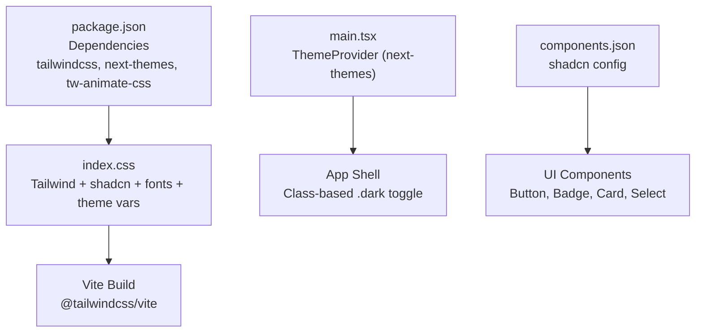
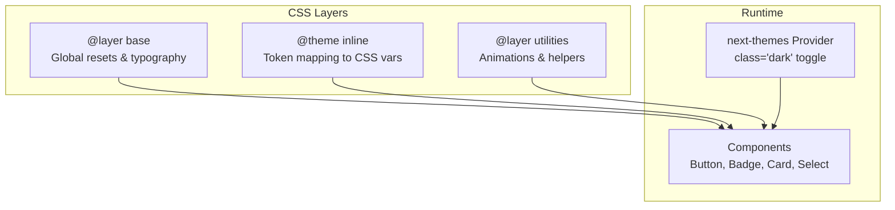
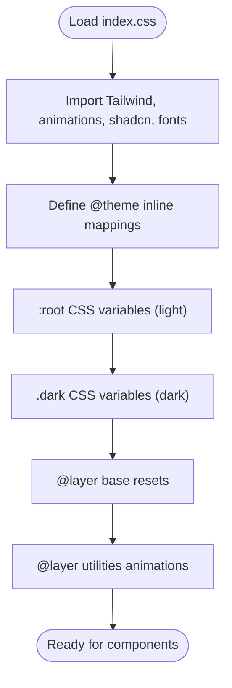
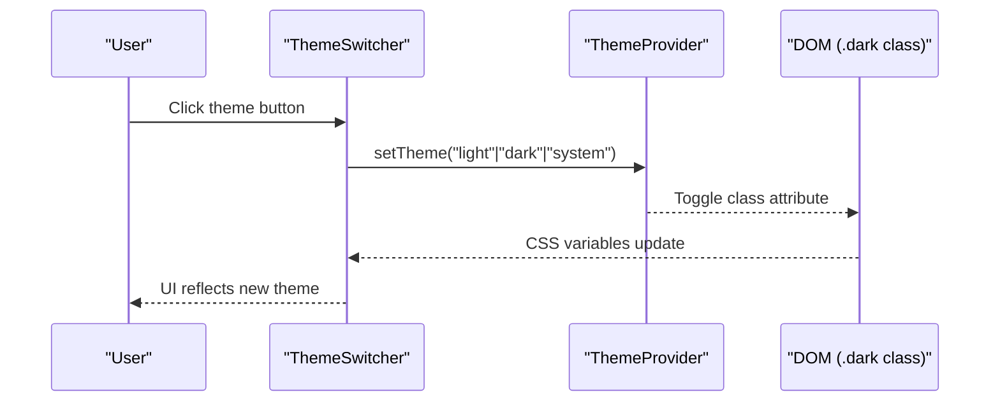
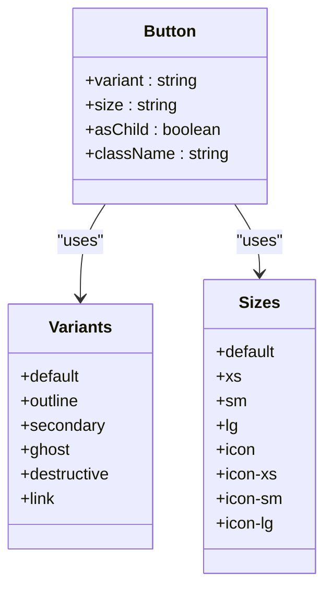
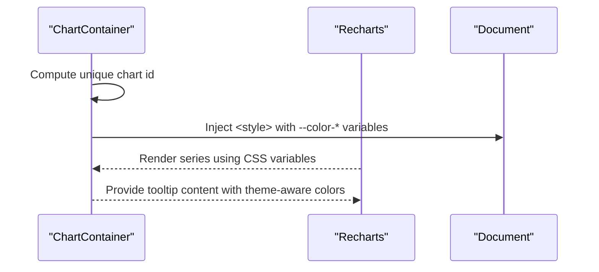
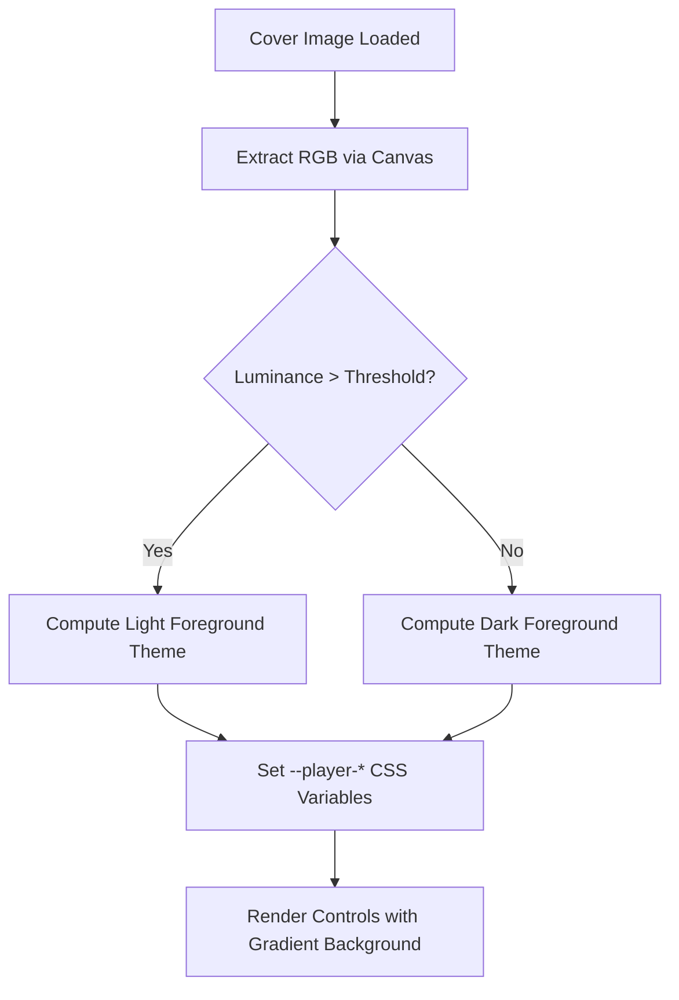
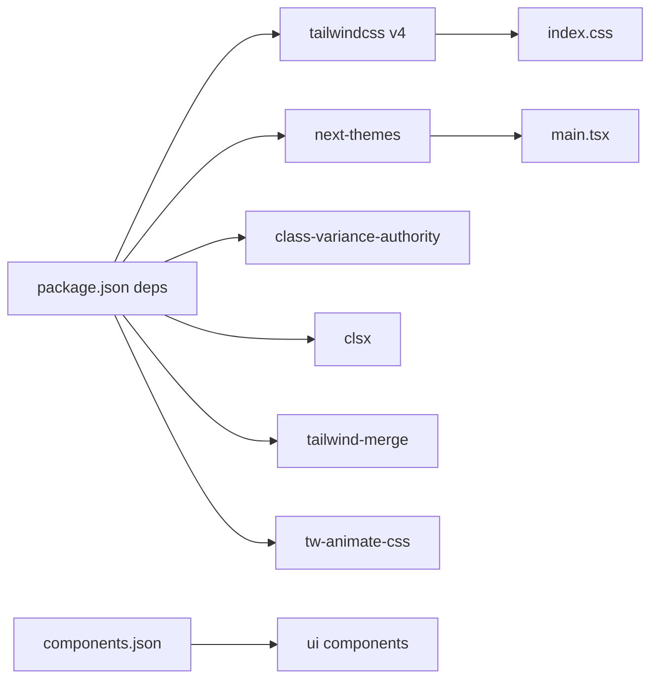

# Styling and Theming

<cite>
**Referenced Files in This Document**
- [index.css](file://src/react-app/index.css)
- [main.tsx](file://src/react-app/main.tsx)
- [ThemeSwitcher.tsx](file://src/react-app/components/ThemeSwitcher.tsx)
- [utils.ts](file://src/react-app/lib/utils.ts)
- [components.json](file://components.json)
- [vite.config.ts](file://vite.config.ts)
- [package.json](file://package.json)
- [button.tsx](file://src/react-app/components/ui/button.tsx)
- [badge.tsx](file://src/react-app/components/ui/badge.tsx)
- [card.tsx](file://src/react-app/components/ui/card.tsx)
- [select.tsx](file://src/react-app/components/ui/select.tsx)
- [chart.tsx](file://src/react-app/components/ui/chart.tsx)
- [AudioPlayerContext.tsx](file://src/react-app/context/AudioPlayerContext.tsx)
</cite>

## Table of Contents
1. [Introduction](#introduction)
2. [Project Structure](#project-structure)
3. [Core Components](#core-components)
4. [Architecture Overview](#architecture-overview)
5. [Detailed Component Analysis](#detailed-component-analysis)
6. [Dependency Analysis](#dependency-analysis)
7. [Performance Considerations](#performance-considerations)
8. [Troubleshooting Guide](#troubleshooting-guide)
9. [Conclusion](#conclusion)

## Introduction
This document explains the styling system built with Tailwind CSS v4 and next-themes. It covers the CSS architecture, utility class organization, custom theme configuration, dark/light theme implementation, theme switching mechanisms, CSS variable usage, component styling patterns, responsive design approaches, typography scales, color systems, spacing utilities, animations, integration with shadcn/ui components, custom style overrides, CSS-in-JS alternatives, and performance considerations such as CSS purging, bundle optimization, and critical CSS extraction.

## Project Structure
The styling system is centered around a single global stylesheet that imports Tailwind v4, animation utilities, shadcn styles, and variable fonts. The application root wraps the app in a ThemeProvider to enable theme toggling via class-based theming. Vite integrates Tailwind v4 through its plugin, and shadcn is configured to use CSS variables and a specific CSS entry point.

**Diagram sources**
- [index.css:1-10](file://src/react-app/index.css#L1-L10)
- [main.tsx:25-36](file://src/react-app/main.tsx#L25-L36)
- [components.json:1-12](file://components.json#L1-L12)
- [vite.config.ts:1-21](file://vite.config.ts#L1-L21)
- [package.json:27-56](file://package.json#L27-L56)

**Section sources**
- [index.css:1-10](file://src/react-app/index.css#L1-L10)
- [main.tsx:25-36](file://src/react-app/main.tsx#L25-L36)
- [components.json:1-12](file://components.json#L1-L12)
- [vite.config.ts:1-21](file://vite.config.ts#L1-L21)
- [package.json:27-56](file://package.json#L27-L56)

## Core Components
- Global stylesheet: Imports Tailwind v4, animation library, shadcn styles, and variable fonts; defines a custom dark variant, inline theme tokens, CSS variables for light/dark palettes, base layer resets, keyframes, and utility classes for animations and interactions.
- Theme provider: Wraps the app with next-themes using class attribute toggling, defaulting to dark and respecting system preferences without transition on change.
- Utility function: A small helper merges class names deterministically using clsx and tailwind-merge to avoid conflicts and ensure consistent output.
- shadcn configuration: Points to the CSS entry, enables CSS variables, sets base color and aliases for components and utils.

Key responsibilities:
- Centralized token definitions and palette mapping for both themes.
- Consistent component variants and states via class-variance-authority and Tailwind utilities.
- Responsive and accessible patterns across UI primitives.

**Section sources**
- [index.css:10-139](file://src/react-app/index.css#L10-L139)
- [main.tsx:25-36](file://src/react-app/main.tsx#L25-L36)
- [utils.ts:1-7](file://src/react-app/lib/utils.ts#L1-L7)
- [components.json:1-12](file://components.json#L1-L12)

## Architecture Overview
The styling architecture follows a layered approach:
- Base layer: Global resets, typography defaults, selection colors, and body/html settings.
- Theme layer: CSS variables define semantic tokens for background, foreground, primary, secondary, destructive, borders, inputs, rings, charts, and sidebar elements. Inline theme mappings expose these tokens to Tailwind’s theme system.
- Utilities layer: Animation keyframes and reusable utility classes for auth screens, interactive surfaces, and motion preferences.
- Component layer: shadcn/ui primitives styled with Tailwind utilities and class-variance-authority variants, consuming theme tokens via CSS variables.

**Diagram sources**
- [index.css:125-139](file://src/react-app/index.css#L125-L139)
- [index.css:10-51](file://src/react-app/index.css#L10-L51)
- [index.css:185-238](file://src/react-app/index.css#L185-L238)
- [main.tsx:25-36](file://src/react-app/main.tsx#L25-L36)

## Detailed Component Analysis

### Global Styles and Theme Variables
- Imports Tailwind v4, animation library, shadcn styles, and variable fonts.
- Defines a custom dark variant selector for scoped dark styles.
- Maps Tailwind theme tokens to CSS variables for seamless theme switching.
- Declares light and dark palettes using OKLCH colors for perceptual uniformity.
- Establishes base layer rules for accessibility and consistency.
- Provides keyframes and utility classes for animations and interactions, including reduced-motion support.

**Diagram sources**
- [index.css:1-7](file://src/react-app/index.css#L1-L7)
- [index.css:10-51](file://src/react-app/index.css#L10-L51)
- [index.css:53-123](file://src/react-app/index.css#L53-L123)
- [index.css:125-139](file://src/react-app/index.css#L125-L139)
- [index.css:185-238](file://src/react-app/index.css#L185-L238)

**Section sources**
- [index.css:1-139](file://src/react-app/index.css#L1-139)
- [index.css:185-238](file://src/react-app/index.css#L185-L238)

### Theme Provider and Switching Mechanism
- The app root uses next-themes with attribute="class", defaultTheme="dark", and disableTransitionOnChange to prevent flicker during theme changes.
- A dedicated ThemeSwitcher component exposes three options: light, dark, and system, updating the active theme via setTheme.
- Components consume theme state indirectly through CSS variables and Tailwind utilities; no direct theme prop drilling is required.

**Diagram sources**
- [main.tsx:25-36](file://src/react-app/main.tsx#L25-L36)
- [ThemeSwitcher.tsx:1-37](file://src/react-app/components/ThemeSwitcher.tsx#L1-L37)

**Section sources**
- [main.tsx:25-36](file://src/react-app/main.tsx#L25-L36)
- [ThemeSwitcher.tsx:1-37](file://src/react-app/components/ThemeSwitcher.tsx#L1-L37)

### Button Component Pattern
- Uses class-variance-authority to define variants (default, outline, secondary, ghost, destructive, link) and sizes (default, xs, sm, lg, icon variants).
- Applies Tailwind utilities for layout, transitions, focus states, and accessibility attributes.
- Integrates with the shared cn utility for deterministic class merging.

**Diagram sources**
- [button.tsx:1-66](file://src/react-app/components/ui/button.tsx#L1-L66)

**Section sources**
- [button.tsx:1-66](file://src/react-app/components/ui/button.tsx#L1-L66)

### Badge Component Pattern
- Variant-driven styling for default, secondary, destructive, outline, ghost, and link modes.
- Focus-visible ring behavior and aria-invalid states for form accessibility.
- Icon slotting and sizing handled via data attributes and Tailwind selectors.

**Section sources**
- [badge.tsx:1-49](file://src/react-app/components/ui/badge.tsx#L1-L49)

### Card Component Pattern
- Composed of Card, CardHeader, CardTitle, CardDescription, CardAction, CardContent, CardFooter.
- Uses data-slot attributes for targeted styling and responsive padding adjustments based on size.
- Leverages container queries and group modifiers for internal layout control.

**Section sources**
- [card.tsx:1-101](file://src/react-app/components/ui/card.tsx#L1-L101)

### Select Component Pattern
- Radix UI primitive wrapped with Tailwind utilities for appearance, focus states, and animations.
- Data attributes drive positioning and open/closed states; content supports backdrop blur and smooth transitions.

**Section sources**
- [select.tsx:1-134](file://src/react-app/components/ui/select.tsx#L1-L134)

### Chart Component and Dynamic CSS-in-JS
- Generates per-chart CSS variables for series colors scoped to light and dark themes.
- Injects a <style> block at runtime to map chart IDs to theme-specific color variables.
- Tooltip rendering uses computed labels and indicators, integrating with theme tokens.

**Diagram sources**
- [chart.tsx:1-115](file://src/react-app/components/ui/chart.tsx#L1-L115)
- [chart.tsx:116-271](file://src/react-app/components/ui/chart.tsx#L116-L271)

**Section sources**
- [chart.tsx:1-115](file://src/react-app/components/ui/chart.tsx#L1-L115)
- [chart.tsx:116-271](file://src/react-app/components/ui/chart.tsx#L116-L271)

### Audio Player Context and Dynamic Themes
- Computes a dynamic theme from cover art colors using luminance calculations and channel mixing.
- Exposes player-specific CSS variables (--player-bg-start, --player-fg, etc.) and maps some to global tokens like --primary.
- Renders controls and sliders styled with these variables, ensuring contrast and visual harmony.

**Diagram sources**
- [AudioPlayerContext.tsx:57-108](file://src/react-app/context/AudioPlayerContext.tsx#L57-L108)
- [AudioPlayerContext.tsx:110-127](file://src/react-app/context/AudioPlayerContext.tsx#L110-L127)

**Section sources**
- [AudioPlayerContext.tsx:57-108](file://src/react-app/context/AudioPlayerContext.tsx#L57-L108)
- [AudioPlayerContext.tsx:110-127](file://src/react-app/context/AudioPlayerContext.tsx#L110-L127)

## Dependency Analysis
- Tailwind CSS v4 is integrated via the Vite plugin and imported in the global stylesheet.
- next-themes provides theme context and class toggling.
- shadcn/ui components are configured to use CSS variables and Tailwind utilities.
- class-variance-authority drives component variants; clsx and tailwind-merge ensure robust class merging.
- tw-animate-css supplies animation utilities used by the application.

**Diagram sources**
- [package.json:27-56](file://package.json#L27-L56)
- [components.json:1-12](file://components.json#L1-L12)
- [vite.config.ts:1-21](file://vite.config.ts#L1-L21)

**Section sources**
- [package.json:27-56](file://package.json#L27-L56)
- [components.json:1-12](file://components.json#L1-L12)
- [vite.config.ts:1-21](file://vite.config.ts#L1-L21)

## Performance Considerations
- CSS Purging: Tailwind v4 generates only used utilities; ensure all class names are present in source files to avoid missing styles. Avoid arbitrary values when possible to keep the bundle lean.
- Bundle Optimization: Use Vite’s production build pipeline; leverage code splitting via TanStack Router autoCodeSplitting to reduce initial payload.
- Critical CSS Extraction: Keep essential base styles and theme variables in the initial CSS load; defer non-critical animations and heavy utilities where feasible.
- Reduced Motion: Respect prefers-reduced-motion to disable animations for users who prefer minimal motion.
- Runtime CSS Injection: Chart and audio player components inject CSS variables dynamically; scope these carefully to avoid reflows and excessive style recalculations.
- Font Loading: Variable fonts are imported directly; consider preloading critical font subsets to improve perceived performance.

[No sources needed since this section provides general guidance]

## Troubleshooting Guide
- Theme not applying: Ensure the root element has the correct attribute mode and that the .dark class is toggled by next-themes. Verify CSS variables are defined under both :root and .dark.
- Inconsistent class merging: Always use the shared cn utility to merge classes; avoid manual concatenation which can lead to conflicting Tailwind utilities.
- Missing shadcn styles: Confirm components.json points to the correct CSS entry and that shadcn styles are imported in index.css.
- Animations not visible: Check that tw-animate-css is imported and that keyframes are defined; verify media queries for hover and pointer capabilities.
- Chart colors incorrect: Ensure chart IDs are unique and that theme-specific CSS variables are injected correctly; confirm light/dark selectors match the current theme.

**Section sources**
- [index.css:53-123](file://src/react-app/index.css#L53-L123)
- [utils.ts:1-7](file://src/react-app/lib/utils.ts#L1-L7)
- [components.json:1-12](file://components.json#L1-L12)
- [chart.tsx:1-115](file://src/react-app/components/ui/chart.tsx#L1-L115)

## Conclusion
The styling system leverages Tailwind CSS v4 for utility-first design, next-themes for robust theme management, and shadcn/ui for accessible, composable components. CSS variables provide a flexible foundation for light and dark palettes, while class-variance-authority standardizes component variants. The architecture balances maintainability and performance through careful layering, reduced-motion support, and dynamic CSS injection where necessary. Following the patterns outlined here ensures consistent, scalable, and performant styling across the application.