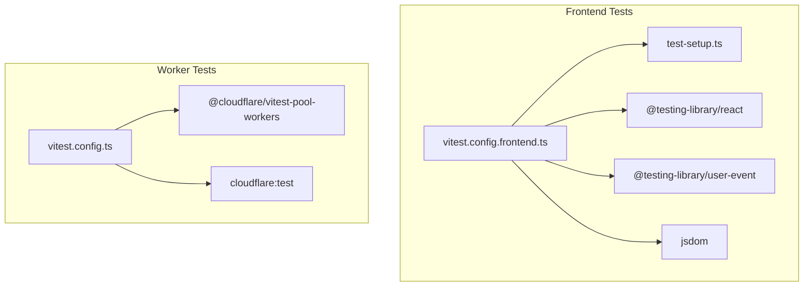
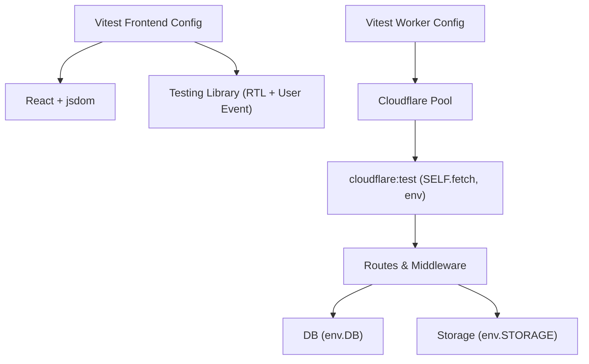
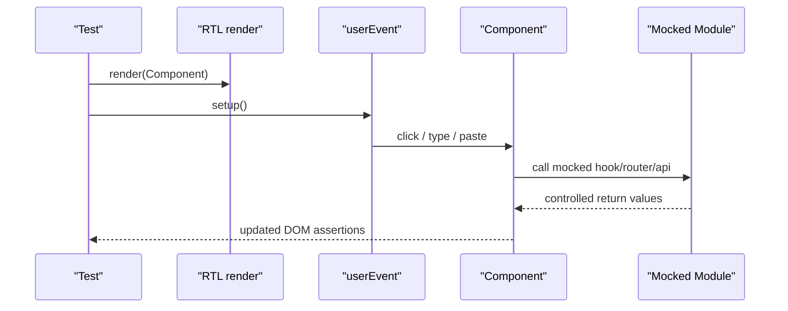
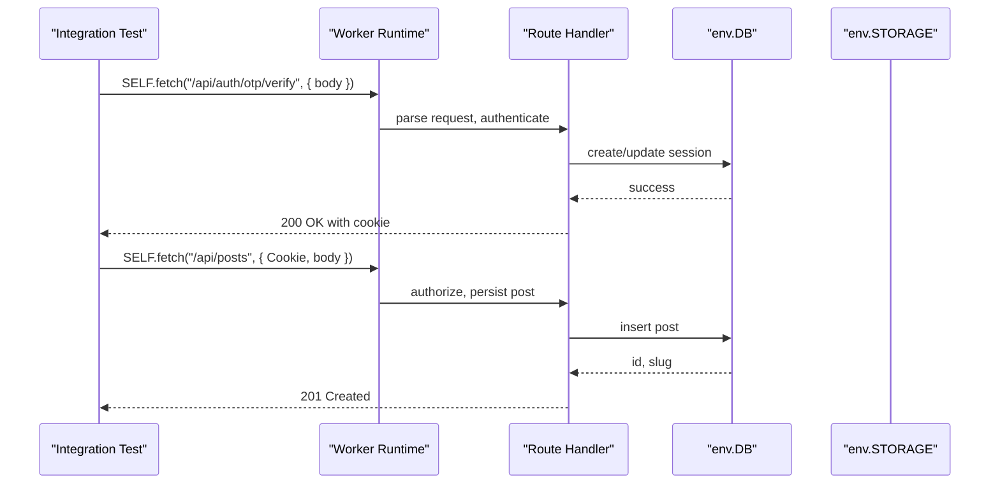
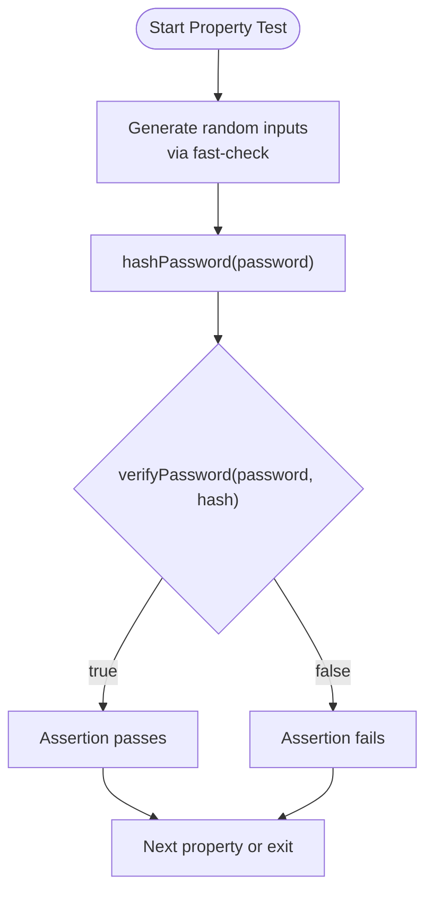
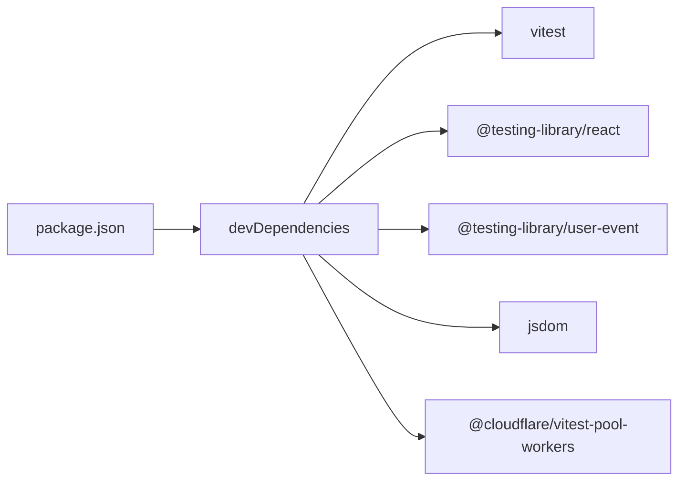

# Testing Strategy

<cite>
**Referenced Files in This Document**
- [vitest.config.ts](file://vitest.config.ts)
- [vitest.config.frontend.ts](file://vitest.config.frontend.ts)
- [test-setup.ts](file://src/react-app/test-setup.ts)
- [package.json](file://package.json)
- [input-otp.test.tsx](file://src/react-app/components/ui/input-otp.test.tsx)
- [AppShell.test.tsx](file://src/react-app/components/AppShell.test.tsx)
- [CreatorRoute.test.tsx](file://src/react-app/components/CreatorRoute.test.tsx)
- [AdminPage.test.tsx](file://src/react-app/pages/AdminPage.test.tsx)
- [crypto.test.ts](file://src/worker/lib/crypto.test.ts)
- [auth.integration.test.ts](file://src/worker/routes/auth.integration.test.ts)
- [admin-migration.test.ts](file://src/worker/db/admin-migration.test.ts)
- [profile-content.test.ts](file://src/react-app/lib/profile-content.test.ts)
</cite>

## Table of Contents
1. [Introduction](#introduction)
2. [Project Structure](#project-structure)
3. [Core Components](#core-components)
4. [Architecture Overview](#architecture-overview)
5. [Detailed Component Analysis](#detailed-component-analysis)
6. [Dependency Analysis](#dependency-analysis)
7. [Performance Considerations](#performance-considerations)
8. [Troubleshooting Guide](#troubleshooting-guide)
9. [Conclusion](#conclusion)
10. [Appendices](#appendices)

## Introduction
This document defines the testing strategy for the project using Vitest and Testing Library across both frontend (React) and backend (Cloudflare Workers). It covers unit tests for components, hooks, and utilities; integration tests for pages, routing, and API interactions; mock strategies for external dependencies, database operations, and third-party services; snapshot and accessibility considerations; asynchronous patterns; and guidelines for organization, naming, and coverage. The examples are grounded in the existing test files and configuration to ensure practical applicability.

## Project Structure
The repository uses two separate Vitest configurations:
- Frontend tests run in a jsdom environment with React support and an alias for the application source.
- Worker tests run in the Cloudflare Workers environment via the dedicated pool.

**Diagram sources**
- [vitest.config.frontend.ts:1-19](file://vitest.config.frontend.ts#L1-L19)
- [vitest.config.ts:1-14](file://vitest.config.ts#L1-L14)
- [test-setup.ts:1-10](file://src/react-app/test-setup.ts#L1-L10)

**Section sources**
- [vitest.config.frontend.ts:1-19](file://vitest.config.frontend.ts#L1-L19)
- [vitest.config.ts:1-14](file://vitest.config.ts#L1-L14)
- [package.json:58-81](file://package.json#L58-L81)

## Core Components
- Test runners and environments:
  - Frontend: jsdom, React plugin, global setup file.
  - Worker: Cloudflare test pool and cloudflare:test globals.
- UI testing:
  - @testing-library/react for rendering and queries.
  - @testing-library/user-event for realistic user interactions.
- Backend testing:
  - SELF.fetch to call routes within the worker runtime.
  - Direct DB access via env.DB for seeding and assertions.
- Property-based testing:
  - fast-check used to assert cryptographic behavior over randomized inputs.

Key implementation references:
- Frontend config and setup: [vitest.config.frontend.ts:1-19](file://vitest.config.frontend.ts#L1-L19), [test-setup.ts:1-10](file://src/react-app/test-setup.ts#L1-L10)
- Worker config: [vitest.config.ts:1-14](file://vitest.config.ts#L1-L14)
- Package scripts and devDependencies: [package.json:83-98](file://package.json#L83-L98), [package.json:58-81](file://package.json#L58-L81)

**Section sources**
- [vitest.config.frontend.ts:1-19](file://vitest.config.frontend.ts#L1-L19)
- [vitest.config.ts:1-14](file://vitest.config.ts#L1-L14)
- [test-setup.ts:1-10](file://src/react-app/test-setup.ts#L1-L10)
- [package.json:58-98](file://package.json#L58-L98)

## Architecture Overview
The testing architecture separates concerns by environment and layer:
- Unit tests validate isolated logic (components, hooks, utilities).
- Integration tests exercise full request/response flows, including auth, storage, and DB migrations.
- Mocks isolate external systems (routing, auth context, HTTP clients).

**Diagram sources**
- [vitest.config.frontend.ts:1-19](file://vitest.config.frontend.ts#L1-L19)
- [vitest.config.ts:1-14](file://vitest.config.ts#L1-L14)
- [auth.integration.test.ts:1-609](file://src/worker/routes/auth.integration.test.ts#L1-L609)

## Detailed Component Analysis

### Frontend Unit Testing Patterns
- Rendering and interaction:
  - Use render from @testing-library/react and screen queries.
  - Simulate user actions with userEvent.setup() and keyboard/paste events.
- Context and routing mocks:
  - vi.mock for router and context modules to control state and navigation.
- QueryClient isolation:
  - Wrap components with QueryClientProvider and disable retries for deterministic tests.

Examples:
- OTP input component tests keyboard and paste behavior: [input-otp.test.tsx:1-60](file://src/react-app/components/ui/input-otp.test.tsx#L1-L60)
- AppShell tests navigation and auth-driven redirects: [AppShell.test.tsx:1-109](file://src/react-app/components/AppShell.test.tsx#L1-L109)
- CreatorRoute guards role-based access and loading states: [CreatorRoute.test.tsx:1-115](file://src/react-app/components/CreatorRoute.test.tsx#L1-L115)
- AdminPage integrates mocked API calls and renders data-driven views: [AdminPage.test.tsx:1-80](file://src/react-app/pages/AdminPage.test.tsx#L1-L80)

**Diagram sources**
- [input-otp.test.tsx:1-60](file://src/react-app/components/ui/input-otp.test.tsx#L1-L60)
- [AppShell.test.tsx:1-109](file://src/react-app/components/AppShell.test.tsx#L1-L109)
- [CreatorRoute.test.tsx:1-115](file://src/react-app/components/CreatorRoute.test.tsx#L1-L115)
- [AdminPage.test.tsx:1-80](file://src/react-app/pages/AdminPage.test.tsx#L1-L80)

**Section sources**
- [input-otp.test.tsx:1-60](file://src/react-app/components/ui/input-otp.test.tsx#L1-L60)
- [AppShell.test.tsx:1-109](file://src/react-app/components/AppShell.test.tsx#L1-L109)
- [CreatorRoute.test.tsx:1-115](file://src/react-app/components/CreatorRoute.test.tsx#L1-L115)
- [AdminPage.test.tsx:1-80](file://src/react-app/pages/AdminPage.test.tsx#L1-L80)

### Worker Integration Testing Patterns
- End-to-end route testing:
  - Use SELF.fetch to call endpoints with cookies and payloads.
  - Assert status codes, headers, and JSON bodies.
- Database seeding and assertions:
  - Apply SQL migrations directly via env.DB.prepare(...).run().
  - Insert seed data and verify persistence and side effects.
- Storage and media handling:
  - Upload files via FormData and assert content types, range responses, and storage keys.

Example flow:
- Create subscriber session via OTP, then exercise posts, likes, replies, and media uploads: [auth.integration.test.ts:1-609](file://src/worker/routes/auth.integration.test.ts#L1-L609)
- Verify migration integrity and preservation of existing records: [admin-migration.test.ts:1-40](file://src/worker/db/admin-migration.test.ts#L1-L40)

**Diagram sources**
- [auth.integration.test.ts:1-609](file://src/worker/routes/auth.integration.test.ts#L1-L609)
- [admin-migration.test.ts:1-40](file://src/worker/db/admin-migration.test.ts#L1-L40)

**Section sources**
- [auth.integration.test.ts:1-609](file://src/worker/routes/auth.integration.test.ts#L1-L609)
- [admin-migration.test.ts:1-40](file://src/worker/db/admin-migration.test.ts#L1-L40)

### Utility and Property-Based Testing
- Cryptographic property tests validate hash round-trips, wrong password rejection, and malformed hash handling using fast-check.

References:
- [crypto.test.ts:1-50](file://src/worker/lib/crypto.test.ts#L1-L50)

**Diagram sources**
- [crypto.test.ts:1-50](file://src/worker/lib/crypto.test.ts#L1-L50)

**Section sources**
- [crypto.test.ts:1-50](file://src/worker/lib/crypto.test.ts#L1-L50)

### Pure Utility Tests
- Normalize and shuffle creator profile items without mutating inputs.

References:
- [profile-content.test.ts:1-38](file://src/react-app/lib/profile-content.test.ts#L1-L38)

**Section sources**
- [profile-content.test.ts:1-38](file://src/react-app/lib/profile-content.test.ts#L1-L38)

## Dependency Analysis
- Frontend test dependencies:
  - @testing-library/react, @testing-library/user-event, jsdom, vitest, @vitejs/plugin-react.
- Worker test dependencies:
  - @cloudflare/vitest-pool-workers, cloudflare:test globals.
- Application dependencies under test:
  - React Router, AuthContext, TanStack Query, API helpers.

**Diagram sources**
- [package.json:58-81](file://package.json#L58-L81)

**Section sources**
- [package.json:58-81](file://package.json#L58-L81)

## Performance Considerations
- Keep unit tests fast and deterministic:
  - Disable retries in QueryClient for tests to avoid flakiness.
  - Prefer mocking network calls and contexts over real integrations.
- Isolate integration tests:
  - Use in-memory or ephemeral DB instances where possible.
  - Reset state between tests to prevent cross-test pollution.
- Avoid heavy snapshots:
  - Prefer semantic assertions over brittle snapshots for UI changes.

[No sources needed since this section provides general guidance]

## Troubleshooting Guide
Common issues and resolutions:
- ResizeObserver errors in jsdom:
  - Provide a minimal mock in the setup file to stub observe/unobserve/disconnect.
  - Reference: [test-setup.ts:1-10](file://src/react-app/test-setup.ts#L1-L10)
- Flaky async tests:
  - Ensure all promises resolve before assertions; use findBy* queries for async elements.
  - In worker tests, await response.json() and arrayBuffer() appropriately.
- Migration failures:
  - Split SQL statements by the documented breakpoint and execute sequentially.
  - Validate preconditions and seed data before applying migrations.

**Section sources**
- [test-setup.ts:1-10](file://src/react-app/test-setup.ts#L1-L10)
- [auth.integration.test.ts:1-609](file://src/worker/routes/auth.integration.test.ts#L1-L609)
- [admin-migration.test.ts:1-40](file://src/worker/db/admin-migration.test.ts#L1-L40)

## Conclusion
The testing strategy combines robust unit tests for React components and utilities with comprehensive integration tests for worker routes, authentication flows, and data persistence. By leveraging Vitest’s dual environments, Testing Library for UI behavior, and cloudflare:test for server-side verification, the suite ensures correctness across layers while maintaining speed and reliability.

[No sources needed since this section summarizes without analyzing specific files]

## Appendices

### Test Organization and Naming Conventions
- Place tests adjacent to their source files with .test.ts or .test.tsx suffixes.
- Group related behaviors using describe blocks that mirror feature names.
- Name tests to express expected behavior, e.g., “renders typed and pasted digits in the OTP slots”.

References:
- [input-otp.test.tsx:1-60](file://src/react-app/components/ui/input-otp.test.tsx#L1-L60)
- [AppShell.test.tsx:1-109](file://src/react-app/components/AppShell.test.tsx#L1-L109)
- [CreatorRoute.test.tsx:1-115](file://src/react-app/components/CreatorRoute.test.tsx#L1-L115)
- [AdminPage.test.tsx:1-80](file://src/react-app/pages/AdminPage.test.tsx#L1-L80)
- [crypto.test.ts:1-50](file://src/worker/lib/crypto.test.ts#L1-L50)
- [auth.integration.test.ts:1-609](file://src/worker/routes/auth.integration.test.ts#L1-L609)
- [admin-migration.test.ts:1-40](file://src/worker/db/admin-migration.test.ts#L1-L40)
- [profile-content.test.ts:1-38](file://src/react-app/lib/profile-content.test.ts#L1-L38)

### Mock Strategies
- Modules:
  - vi.mock for router, contexts, and API helpers to control behavior deterministically.
- External services:
  - For worker tests, use cloudflare:test to interact with env.DB and env.STORAGE instead of mocking them.
- Network:
  - Prefer mocking fetch-like APIs at the module level when testing components that depend on remote data.

References:
- [AppShell.test.tsx:1-109](file://src/react-app/components/AppShell.test.tsx#L1-L109)
- [AdminPage.test.tsx:1-80](file://src/react-app/pages/AdminPage.test.tsx#L1-L80)
- [auth.integration.test.ts:1-609](file://src/worker/routes/auth.integration.test.ts#L1-L609)

### Asynchronous Testing Patterns
- Use async/await consistently.
- For UI, prefer findBy* queries to wait for async updates.
- For worker tests, await response.json(), arrayBuffer(), and DB operations.

References:
- [input-otp.test.tsx:1-60](file://src/react-app/components/ui/input-otp.test.tsx#L1-L60)
- [AdminPage.test.tsx:1-80](file://src/react-app/pages/AdminPage.test.tsx#L1-L80)
- [auth.integration.test.ts:1-609](file://src/worker/routes/auth.integration.test.ts#L1-L609)

### Coverage Requirements
- Aim for high branch and function coverage on critical paths (auth, payments, scheduling).
- Prioritize integration coverage for routes that touch DB and storage.
- Use CI to enforce thresholds and fail builds on regressions.

[No sources needed since this section provides general guidance]

### Accessibility Testing
- Ensure interactive elements have accessible labels and roles.
- Use screen.getByRole and aria attributes in assertions.
- Consider adding axe-core checks in a dedicated suite if needed.

References:
- [input-otp.test.tsx:1-60](file://src/react-app/components/ui/input-otp.test.tsx#L1-L60)
- [AppShell.test.tsx:1-109](file://src/react-app/components/AppShell.test.tsx#L1-L109)

### Snapshot and Visual Regression
- Prefer semantic assertions over snapshots for UI stability.
- If snapshots are necessary, keep them small and focused on stable structures.
- Integrate visual regression tools only for critical UI surfaces.

[No sources needed since this section provides general guidance]

### Real-time Features Testing
- For streaming or range requests, assert status codes and headers explicitly.
- Validate partial content delivery and correct content-type headers.

References:
- [auth.integration.test.ts:1-609](file://src/worker/routes/auth.integration.test.ts#L1-L609)