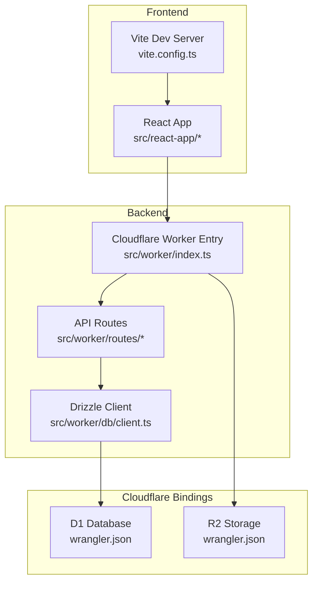
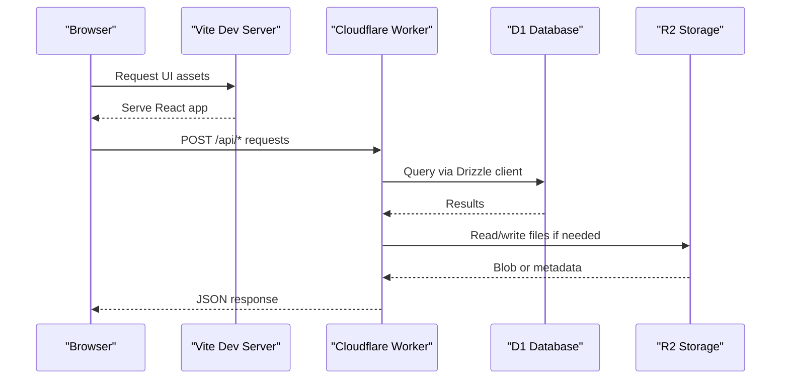
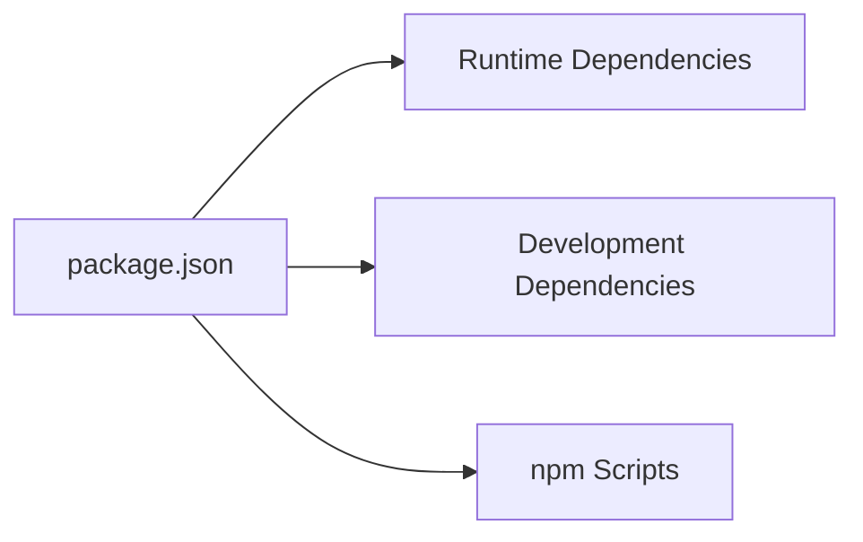

# Getting Started

<cite>
**Referenced Files in This Document**
- [package.json](file://package.json)
- [wrangler.json](file://wrangler.json)
- [drizzle.config.ts](file://drizzle.config.ts)
- [vite.config.ts](file://vite.config.ts)
- [src/worker/index.ts](file://src/worker/index.ts)
- [src/worker/db/client.ts](file://src/worker/db/client.ts)
- [src/worker/lib/payments/config.ts](file://src/worker/lib/payments/config.ts)
- [AGENTS.md](file://AGENTS.md)
- [SKILL.md](file://SKILL.md)
</cite>

## Table of Contents
1. Introduction
2. Project Structure
3. Core Components
4. Architecture Overview
5. Detailed Component Analysis
6. Dependency Analysis
7. Performance Considerations
8. Troubleshooting Guide
9. Conclusion

## Introduction
This guide helps you set up and run Zenith locally, covering prerequisites, installation, environment configuration, database setup, and development workflows. Zenith is a full-stack creator network app built with Cloudflare Workers (Hono), Drizzle ORM, and a Vite React frontend. You will use Wrangler for local development and deployment, and Drizzle Kit for migrations against Cloudflare D1.

## Project Structure
At a high level:
- Backend API routes are implemented as Hono handlers under src/worker. The main worker entry mounts all API routes and handles assets fallback.
- Database schema and client live under src/worker/db. Drizzle config points to the schema and uses the d1-http driver.
- Frontend is a Vite React app under src/react-app, configured via vite.config.ts with TanStack Router and Tailwind CSS v4.
- Cloudflare bindings for D1 and R2 are defined in wrangler.json, including environment-specific settings and secrets.

**Diagram sources**
- [vite.config.ts:1-28](file://vite.config.ts#L1-L28)
- [src/worker/index.ts:1-71](file://src/worker/index.ts#L1-L71)
- [src/worker/db/client.ts:1-9](file://src/worker/db/client.ts#L1-L9)
- [wrangler.json:1-139](file://wrangler.json#L1-L139)

**Section sources**
- [package.json:1-98](file://package.json#L1-L98)
- [wrangler.json:1-139](file://wrangler.json#L1-L139)
- [vite.config.ts:1-28](file://vite.config.ts#L1-L28)
- [src/worker/index.ts:1-71](file://src/worker/index.ts#L1-L71)
- [src/worker/db/client.ts:1-9](file://src/worker/db/client.ts#L1-L9)

## Core Components
- Cloudflare Worker entrypoint mounts Hono routes and exposes fetch and scheduled handlers. It also serves static assets from the Vite build when not matching /api routes.
- Drizzle client wraps a D1Database instance with typed schema access.
- Payment configuration enforces Stripe sandbox mode and validates required keys and account IDs.
- Vite config enables React, TanStack Router code splitting, Tailwind CSS v4, and Cloudflare plugin integration.

Key responsibilities:
- Routing and error handling: src/worker/index.ts
- Database access: src/worker/db/client.ts
- Payments validation: src/worker/lib/payments/config.ts
- Build and dev tooling: vite.config.ts, package.json scripts

**Section sources**
- [src/worker/index.ts:1-71](file://src/worker/index.ts#L1-L71)
- [src/worker/db/client.ts:1-9](file://src/worker/db/client.ts#L1-L9)
- [src/worker/lib/payments/config.ts:1-63](file://src/worker/lib/payments/config.ts#L1-L63)
- [vite.config.ts:1-28](file://vite.config.ts#L1-L28)
- [package.json:83-95](file://package.json#L83-L95)

## Architecture Overview
The development flow connects your browser to the Vite dev server, which proxies API calls to the local Cloudflare Worker. The Worker interacts with D1 and R2 through bindings configured in wrangler.json.

**Diagram sources**
- [src/worker/index.ts:1-71](file://src/worker/index.ts#L1-L71)
- [src/worker/db/client.ts:1-9](file://src/worker/db/client.ts#L1-L9)
- [wrangler.json:52-65](file://wrangler.json#L52-L65)

## Detailed Component Analysis

### Prerequisites
- Node.js: Use the version compatible with the project’s toolchain. The repository uses modern packages (Vite 6, TypeScript 5.8, Wrangler 4.x). A recent LTS Node.js release is recommended.
- Cloudflare Account: Required for D1, R2, and Workers. Ensure you have permissions to create databases and buckets.
- Development Tools:
  - npm (or your preferred package manager that supports lockfiles)
  - Wrangler CLI (installed via npm)
  - Git for cloning the repository

**Section sources**
- [package.json:58-81](file://package.json#L58-L81)
- [AGENTS.md:12-20](file://AGENTS.md#L12-L20)

### Installation Steps
1. Clone the repository and install dependencies:
   - Run the standard install command to fetch all dependencies listed in package.json.
2. Generate types for Cloudflare bindings:
   - After any changes to wrangler.json, regenerate types using the Wrangler types command.

**Section sources**
- [package.json:83-95](file://package.json#L83-L95)
- [AGENTS.md:12-20](file://AGENTS.md#L12-L20)

### Environment Configuration
Zenith uses Cloudflare environment variables and secrets. Configure them in wrangler.json and via secrets management.

- Variables (non-secret):
  - PAYMENT_PROVIDER: payment provider selection
  - PLATFORM_FEE_BPS: platform fee basis points
  - STRIPE_MODE: must be test for sandbox
  - STRIPE_ACCOUNT_ID: sandbox Stripe account ID
  - NOTIFICATION_EMAIL_FROM, NOTIFICATION_EMAIL_FROM_NAME, NOTIFICATION_EMAIL_BASE_URL
  - ADMIN_CLOUDFLARE_DASHBOARD_URL

- Secrets (sensitive):
  - BETTER_AUTH_SECRET
  - STRIPE_API_KEY
  - STRIPE_WEBHOOK_SECRET

- D1 binding:
  - Binding name: DB
  - Local database name and id are configured for development; production values differ.

- R2 binding:
  - Binding name: STORAGE
  - Bucket names are configured per environment.

- Email:
  - send_email configuration defines allowed sender addresses.

Important validations enforced by code:
- Stripe API key must start with sandbox prefixes.
- STRIPE_MODE must equal test.
- STRIPE_ACCOUNT_ID must start with the expected prefix.

**Section sources**
- [wrangler.json:34-51](file://wrangler.json#L34-L51)
- [wrangler.json:66-114](file://wrangler.json#L66-L114)
- [src/worker/lib/payments/config.ts:28-49](file://src/worker/lib/payments/config.ts#L28-L49)

### Database Setup and Migrations
- Drizzle configuration uses the d1-http driver and reads credentials from environment variables for account, database, and token.
- Migrations directory is drizzle, containing SQL migration files.
- For local development, the D1 binding in wrangler.json points to a local database.

Steps:
- Ensure CLOUDFLARE_ACCOUNT_ID, CLOUDFLARE_DATABASE_ID, and CLOUDFLARE_D1_TOKEN are set if running Drizzle commands against remote D1.
- Apply migrations using Drizzle Kit according to your workflow. The project references migration files in tests and integrations, indicating how to apply them.

**Section sources**
- [drizzle.config.ts:1-14](file://drizzle.config.ts#L1-L14)
- [wrangler.json:52-59](file://wrangler.json#L52-L59)

### Running the Development Server
- Start the Vite dev server to serve the React frontend and proxy API requests to the Cloudflare Worker.
- The Cloudflare Worker entrypoint mounts all API routes under /api and serves static assets for non-API paths.

Commands:
- Use the dev script defined in package.json to start the Vite development server.
- Use Wrangler commands for local Worker execution and type generation as documented.

**Section sources**
- [package.json:90](file://package.json#L90)
- [src/worker/index.ts:24-60](file://src/worker/index.ts#L24-L60)
- [AGENTS.md:12-20](file://AGENTS.md#L12-L20)

### Initial Data Seeding
- The repository includes extensive migration files under drizzle. Tests demonstrate applying migrations to set up schema state.
- To seed initial data, apply the relevant migrations and then insert baseline records using your preferred method (e.g., Drizzle queries or direct SQL).

Note: There is no dedicated seed script in package.json; seeding is typically done by applying migrations and inserting data programmatically.

**Section sources**
- [wrangler.json:52-59](file://wrangler.json#L52-L59)

### Stripe Integration Notes
- The payment configuration module enforces sandbox-only mode and validates required keys and account IDs.
- Ensure STRIPE_API_KEY, STRIPE_WEBHOOK_SECRET, STRIPE_MODE=test, and STRIPE_ACCOUNT_ID are correctly set.

**Section sources**
- [src/worker/lib/payments/config.ts:1-63](file://src/worker/lib/payments/config.ts#L1-L63)

## Dependency Analysis
The project’s runtime and development dependencies are declared in package.json. Key categories:
- Runtime: Hono, Drizzle ORM, React, TanStack Router, Stripe SDK, Zod validators, Tailwind CSS v4.
- Development: Vite, TypeScript, ESLint, Vitest, Wrangler, Drizzle Kit, Cloudflare Vite plugin.

**Diagram sources**
- [package.json:14-81](file://package.json#L14-L81)
- [package.json:83-95](file://package.json#L83-L95)

**Section sources**
- [package.json:14-81](file://package.json#L14-L81)
- [package.json:83-95](file://package.json#L83-L95)

## Performance Considerations
- Keep route handlers lightweight and validate inputs early to reduce unnecessary processing.
- Prefer streaming responses where possible and avoid heavy synchronous operations in request handlers.
- Use Cloudflare observability features enabled in wrangler.json for logs and traces during development and production.

[No sources needed since this section provides general guidance]

## Troubleshooting Guide
Common issues and resolutions:
- Missing or invalid Stripe configuration:
  - Ensure STRIPE_API_KEY starts with sandbox prefixes and STRIPE_MODE equals test.
  - Verify STRIPE_ACCOUNT_ID has the expected format.
- D1 connection errors:
  - Confirm CLOUDFLARE_ACCOUNT_ID, CLOUDFLARE_DATABASE_ID, and CLOUDFLARE_D1_TOKEN are set when running Drizzle commands.
  - Check wrangler.json D1 binding configuration for local vs. production environments.
- Type errors after changing bindings:
  - Regenerate types using the Wrangler types command.
- Assets not served:
  - Ensure the Vite build output directory matches the assets configuration in wrangler.json and that the Worker entrypoint returns ASSETS.fetch for non-API routes.

**Section sources**
- [src/worker/lib/payments/config.ts:28-49](file://src/worker/lib/payments/config.ts#L28-L49)
- [drizzle.config.ts:8-12](file://drizzle.config.ts#L8-L12)
- [wrangler.json:52-65](file://wrangler.json#L52-L65)
- [src/worker/index.ts:52-60](file://src/worker/index.ts#L52-L60)
- [AGENTS.md:12-20](file://AGENTS.md#L12-L20)

## Conclusion
You now have the essential steps to set up Zenith locally, configure Cloudflare services, manage database migrations, and run the development server. Use the provided scripts and configurations to iterate quickly, and refer to the troubleshooting section for common pitfalls. For advanced workflows, consult the referenced files for deeper insights into routing, database access, and payment configuration.

[No sources needed since this section summarizes without analyzing specific files]