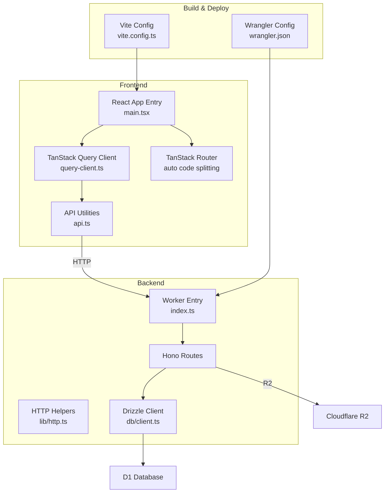
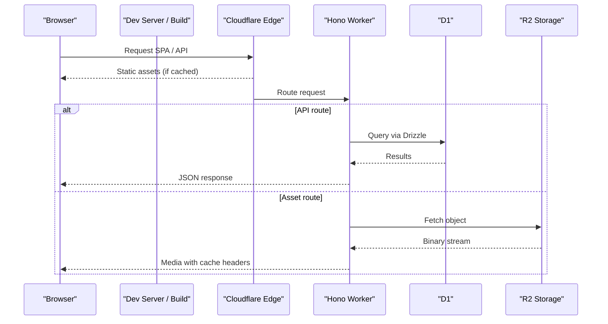
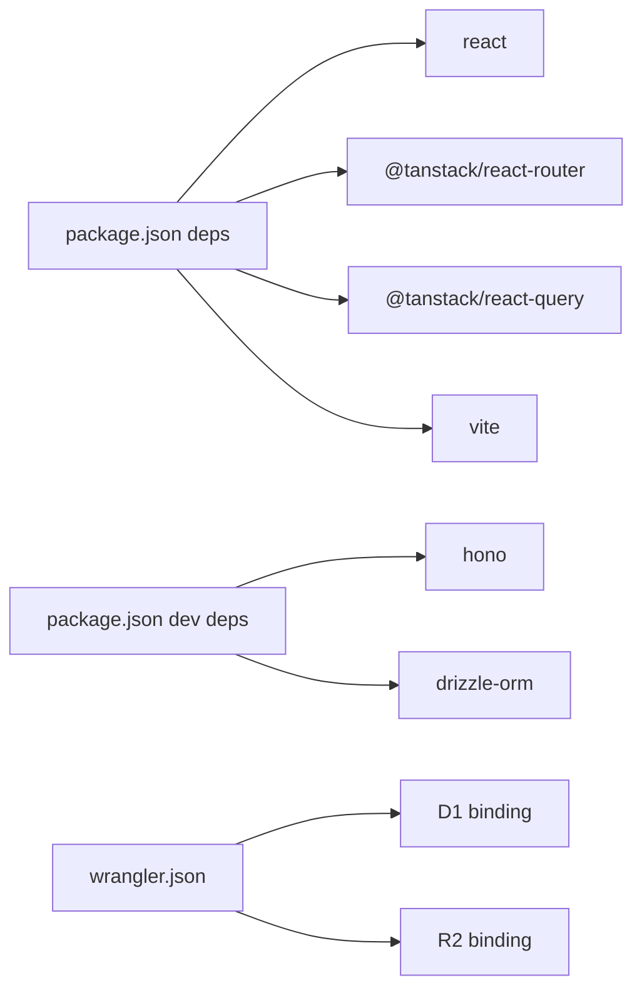

# Performance Optimization

<cite>
**Referenced Files in This Document**
- [package.json](file://package.json)
- [vite.config.ts](file://vite.config.ts)
- [wrangler.json](file://wrangler.json)
- [src/react-app/main.tsx](file://src/react-app/main.tsx)
- [src/react-app/lib/query-client.ts](file://src/react-app/lib/query-client.ts)
- [src/worker/index.ts](file://src/worker/index.ts)
- [src/worker/db/client.ts](file://src/worker/db/client.ts)
- [src/worker/lib/http.ts](file://src/worker/lib/http.ts)
- [src/react-app/lib/api.ts](file://src/react-app/lib/api.ts)
- [src/worker/routes/photography.ts](file://src/worker/routes/photography.ts)
- [src/worker/routes/admin.ts](file://src/worker/routes/admin.ts)
- [drizzle.config.ts](file://drizzle.config.ts)
</cite>

## Table of Contents
1. [Introduction](#introduction)
2. [Project Structure](#project-structure)
3. [Core Components](#core-components)
4. [Architecture Overview](#architecture-overview)
5. [Detailed Component Analysis](#detailed-component-analysis)
6. [Dependency Analysis](#dependency-analysis)
7. [Performance Considerations](#performance-considerations)
8. [Troubleshooting Guide](#troubleshooting-guide)
9. [Conclusion](#conclusion)
10. [Appendices](#appendices)

## Introduction
This document provides a comprehensive performance optimization guide for Zenith, covering frontend and backend strategies. It focuses on React optimization patterns, Vite bundle reduction, lazy loading, TanStack Query state management, Cloudflare Workers cold start mitigation, Drizzle ORM query efficiency, caching, image/media optimization, CDN utilization, monitoring, profiling, A/B testing, regression detection, memory management, connection pooling, API response formatting, load testing, and continuous performance monitoring.

## Project Structure
Zenith is a full-stack application with:
- Frontend: React + TanStack Router + TanStack Query, built with Vite
- Backend: Hono-based Cloudflare Worker serving REST APIs and static assets
- Database: D1 via Drizzle ORM
- Storage: R2 for media assets
- Observability: Cloudflare observability enabled (logs and traces)

**Diagram sources**
- [src/react-app/main.tsx:1-38](file://src/react-app/main.tsx#L1-L38)
- [src/react-app/lib/query-client.ts:1-14](file://src/react-app/lib/query-client.ts#L1-L14)
- [src/react-app/lib/api.ts:1-164](file://src/react-app/lib/api.ts#L1-L164)
- [vite.config.ts:1-28](file://vite.config.ts#L1-L28)
- [wrangler.json:1-139](file://wrangler.json#L1-L139)
- [src/worker/index.ts:1-71](file://src/worker/index.ts#L1-L71)
- [src/worker/lib/http.ts:1-80](file://src/worker/lib/http.ts#L1-L80)
- [src/worker/db/client.ts:1-9](file://src/worker/db/client.ts#L1-L9)

**Section sources**
- [package.json:1-98](file://package.json#L1-L98)
- [vite.config.ts:1-28](file://vite.config.ts#L1-L28)
- [wrangler.json:1-139](file://wrangler.json#L1-L139)
- [src/react-app/main.tsx:1-38](file://src/react-app/main.tsx#L1-L38)
- [src/worker/index.ts:1-71](file://src/worker/index.ts#L1-L71)

## Core Components
- Frontend entry initializes React, TanStack Router, and TanStack Query client with tuned defaults to reduce unnecessary refetches and retries.
- Worker entry wires Hono routes and error handling, serves static assets, and exposes scheduled tasks.
- Drizzle client wraps D1 database access with typed schema.
- HTTP helpers standardize error responses and validation hooks.

Key implementation references:
- [src/react-app/main.tsx:1-38](file://src/react-app/main.tsx#L1-L38)
- [src/react-app/lib/query-client.ts:1-14](file://src/react-app/lib/query-client.ts#L1-L14)
- [src/worker/index.ts:1-71](file://src/worker/index.ts#L1-L71)
- [src/worker/db/client.ts:1-9](file://src/worker/db/client.ts#L1-L9)
- [src/worker/lib/http.ts:1-80](file://src/worker/lib/http.ts#L1-L80)

**Section sources**
- [src/react-app/main.tsx:1-38](file://src/react-app/main.tsx#L1-L38)
- [src/react-app/lib/query-client.ts:1-14](file://src/react-app/lib/query-client.ts#L1-L14)
- [src/worker/index.ts:1-71](file://src/worker/index.ts#L1-L71)
- [src/worker/db/client.ts:1-9](file://src/worker/db/client.ts#L1-L9)
- [src/worker/lib/http.ts:1-80](file://src/worker/lib/http.ts#L1-L80)

## Architecture Overview
The system uses a thin Hono server on Cloudflare Workers that serves both API endpoints and static assets. The React frontend consumes APIs through a centralized fetch wrapper and caches data with TanStack Query. Assets are stored in R2 and served via the Worker or CDN.

**Diagram sources**
- [src/worker/index.ts:1-71](file://src/worker/index.ts#L1-L71)
- [wrangler.json:1-139](file://wrangler.json#L1-L139)
- [src/worker/db/client.ts:1-9](file://src/worker/db/client.ts#L1-L9)
- [src/worker/routes/photography.ts:790-829](file://src/worker/routes/photography.ts#L790-L829)

## Detailed Component Analysis

### Frontend Performance: React, Vite, Lazy Loading, and State Management
- Vite configuration enables auto code splitting via TanStack Router plugin, reducing initial bundle size by loading page-specific code on demand.
- Tailwind CSS integration is configured through Vite; ensure only used utilities are included in production builds.
- React app bootstraps with strict mode and providers for theme, auth, audio player, and router.
- TanStack Query client disables automatic retries and window-focus refetch by default to minimize network churn; tune per-query where needed.
- API utilities normalize errors and handle credentials consistently, preventing redundant retry logic at the component level.

Optimization techniques applied:
- Route-level lazy loading via TanStack Router’s auto code splitting.
- Centralized query client configuration to avoid over-fetching.
- Consistent error normalization to prevent repeated failed requests.

Recommendations:
- Use React.lazy and Suspense for heavy components not required on initial render.
- Memoize expensive computations with useMemo/useCallback where appropriate.
- Prefer stable keys and minimal re-renders in lists; virtualize large datasets.
- Configure selective refetch policies per endpoint using query options.

**Section sources**
- [vite.config.ts:1-28](file://vite.config.ts#L1-L28)
- [src/react-app/main.tsx:1-38](file://src/react-app/main.tsx#L1-L38)
- [src/react-app/lib/query-client.ts:1-14](file://src/react-app/lib/query-client.ts#L1-L14)
- [src/react-app/lib/api.ts:1-164](file://src/react-app/lib/api.ts#L1-L164)

### Backend Performance: Cloudflare Workers, Cold Starts, and Efficient Queries
- Worker entry registers all API routes under /api/* and handles not-found routing to serve SPA assets when applicable.
- Error handling is centralized to return consistent JSON error payloads, reducing parsing overhead on clients.
- Scheduled tasks run maintenance operations asynchronously using waitUntil to avoid blocking responses.

Cold start mitigation:
- Keep warm strategies: use lightweight health checks or periodic pings if necessary.
- Minimize initialization work outside handlers; defer heavy setup until first use.
- Avoid synchronous I/O during module load.

Efficient queries with Drizzle:
- Use createDb(d1) to obtain a typed client bound to D1.
- Compose precise queries with select fields to reduce payload sizes.
- Leverage indexes defined in schema for frequent filters and sorts.

Caching strategies:
- Set appropriate Cache-Control headers for asset endpoints (e.g., short-lived private cache for previews/originals).
- Use ETag/Last-Modified semantics where feasible to leverage browser and edge caching.

**Section sources**
- [src/worker/index.ts:1-71](file://src/worker/index.ts#L1-L71)
- [src/worker/lib/http.ts:1-80](file://src/worker/lib/http.ts#L1-L80)
- [src/worker/db/client.ts:1-9](file://src/worker/db/client.ts#L1-L9)
- [src/worker/routes/photography.ts:790-829](file://src/worker/routes/photography.ts#L790-L829)

### Image and Media Optimization, CDN Utilization, and Asset Delivery
- Photography endpoints serve preview and original images from R2 with explicit content-type and cache-control headers.
- Preview URLs are inline-friendly; originals can be forced as attachments with download controls.
- Content-Length headers are set to optimize transfer and streaming.

CDN utilization:
- Cloudflare CDN caches static assets automatically; configure long-lived cache headers for immutable assets.
- Use versioned filenames or cache busting for critical CSS/JS bundles.

Asset delivery best practices:
- Serve modern formats (WebP/AVIF) where supported; fallback gracefully.
- Implement responsive images with srcset and sizes attributes.
- Limit maximum file sizes and validate types server-side to prevent abuse.

**Section sources**
- [src/worker/routes/photography.ts:790-829](file://src/worker/routes/photography.ts#L790-L829)
- [wrangler.json:1-139](file://wrangler.json#L1-L139)

### Monitoring and Profiling Tools
- Observability is enabled in Wrangler config with logs and traces; head sampling rates are configured for cost control.
- Admin dashboard includes health signals and links to Cloudflare metrics for operational insights.

Profiling approaches:
- Use Cloudflare Traces to identify slow endpoints and database calls.
- Instrument custom spans around critical paths (e.g., media upload, membership checks).
- Monitor worker CPU and memory usage via Cloudflare dashboards.

**Section sources**
- [wrangler.json:1-139](file://wrangler.json#L1-L139)
- [src/worker/routes/admin.ts:137-170](file://src/worker/routes/admin.ts#L137-L170)

### A/B Testing and Performance Regression Detection
- Introduce feature flags in environment variables to toggle optimizations incrementally.
- Measure key metrics (TTFB, FCP, LCP, CLS) before and after changes using synthetic tests and real-user monitoring.
- Automate regression checks in CI by running performance budgets and comparing build artifacts.

**Section sources**
- [wrangler.json:1-139](file://wrangler.json#L1-L139)

### Memory Management in Serverless Environments
- Avoid retaining large objects across requests; release buffers promptly.
- Stream responses instead of buffering entire payloads when possible.
- Be mindful of closures capturing large scopes; prefer passing minimal context.

### Connection Pooling for Database Operations
- D1 connections are managed by Cloudflare runtime; avoid creating multiple clients per request unnecessarily.
- Reuse the Drizzle client instance within a handler scope; do not persist across invocations.

### Efficient API Response Formatting
- Standardize error responses with codes and messages to enable fast client-side handling.
- Return only necessary fields; paginate large datasets and support filtering/sorting.

**Section sources**
- [src/worker/lib/http.ts:1-80](file://src/worker/lib/http.ts#L1-L80)
- [src/react-app/lib/api.ts:1-164](file://src/react-app/lib/api.ts#L1-L164)

## Dependency Analysis
Frontend dependencies include React, TanStack Router, TanStack Query, and Vite plugins for code splitting and Tailwind. Backend dependencies include Hono, Drizzle ORM, and Cloudflare bindings for D1 and R2.

**Diagram sources**
- [package.json:1-98](file://package.json#L1-L98)
- [wrangler.json:1-139](file://wrangler.json#L1-L139)

**Section sources**
- [package.json:1-98](file://package.json#L1-L98)
- [wrangler.json:1-139](file://wrangler.json#L1-L139)

## Performance Considerations
- Frontend:
  - Enable route-level code splitting and lazy-load heavy components.
  - Tune TanStack Query options per endpoint to balance freshness and bandwidth.
  - Optimize images and fonts; preload critical resources.
- Backend:
  - Minimize initialization overhead; defer non-critical setup.
  - Use precise queries and pagination; avoid N+1 patterns.
  - Set appropriate cache headers for static and dynamic assets.
- Observability:
  - Enable tracing and logs; sample appropriately to control costs.
  - Track SLOs and alert on regressions.

[No sources needed since this section provides general guidance]

## Troubleshooting Guide
Common issues and resolutions:
- Excessive refetches: Review query client defaults and per-query options; disable unnecessary refetchOnWindowFocus or retries.
- Large bundles: Inspect Vite build output; remove unused dependencies and enable tree-shaking.
- Slow API responses: Profile with Cloudflare Traces; check DB query plans and add indexes.
- Media delivery failures: Validate content types and sizes; ensure R2 permissions and CORS settings.

Error handling patterns:
- Use standardized error responses with codes and messages.
- Normalize API errors on the client to avoid inconsistent handling.

**Section sources**
- [src/react-app/lib/query-client.ts:1-14](file://src/react-app/lib/query-client.ts#L1-L14)
- [src/worker/lib/http.ts:1-80](file://src/worker/lib/http.ts#L1-L80)
- [src/react-app/lib/api.ts:1-164](file://src/react-app/lib/api.ts#L1-L164)

## Conclusion
Zenith’s architecture leverages modern tooling to achieve strong performance: Vite-driven code splitting, TanStack Query for efficient state management, Hono on Cloudflare Workers for low-latency APIs, and R2/D1 for scalable storage and database access. By applying the outlined optimization strategies, monitoring practices, and testing methodologies, teams can maintain high performance and reliability in production.

[No sources needed since this section summarizes without analyzing specific files]

## Appendices

### Performance Testing Methodologies and Load Testing Strategies
- Synthetic testing:
  - Use Lighthouse CI or WebPageTest to measure core web vitals across environments.
  - Run baseline comparisons before and after changes.
- Load testing:
  - Simulate realistic traffic patterns with tools like k6 or Artillery against API endpoints.
  - Measure TTFB, throughput, error rates, and resource utilization.
- Continuous monitoring:
  - Integrate performance budgets into CI pipelines.
  - Alert on regressions in key metrics and worker resource usage.

[No sources needed since this section provides general guidance]

### Drizzle ORM Configuration Reference
- Schema location and dialect are configured for SQLite via D1 HTTP driver.
- Ensure migrations are aligned with schema changes to avoid runtime overhead.

**Section sources**
- [drizzle.config.ts:1-14](file://drizzle.config.ts#L1-L14)