# Project Overview

<cite>
**Referenced Files in This Document**
- [package.json](file://package.json)
- [wrangler.json](file://wrangler.json)
- [src/worker/index.ts](file://src/worker/index.ts)
- [src/react-app/main.tsx](file://src/react-app/main.tsx)
- [drizzle.config.ts](file://drizzle.config.ts)
- [src/worker/db/schema.ts](file://src/worker/db/schema.ts)
- [src/worker/routes/auth.ts](file://src/worker/routes/auth.ts)
- [src/worker/routes/posts.ts](file://src/worker/routes/posts.ts)
- [src/worker/routes/articles.ts](file://src/worker/routes/articles.ts)
- [src/worker/routes/audio.ts](file://src/worker/routes/audio.ts)
- [src/worker/routes/photography.ts](file://src/worker/routes/photography.ts)
- [src/worker/routes/courses.ts](file://src/worker/routes/courses.ts)
- [src/worker/lib/publication.ts](file://src/worker/lib/publication.ts)
- [src/react-app/lib/profile-content.ts](file://src/react-app/lib/profile-content.ts)
</cite>

## Table of Contents
1. [Introduction](#introduction)
2. [Project Structure](#project-structure)
3. [Core Components](#core-components)
4. [Architecture Overview](#architecture-overview)
5. [Detailed Component Analysis](#detailed-component-analysis)
6. [Dependency Analysis](#dependency-analysis)
7. [Performance Considerations](#performance-considerations)
8. [Troubleshooting Guide](#troubleshooting-guide)
9. [Conclusion](#conclusion)

## Introduction
Zenith is a full-stack creator network platform designed to help creators publish, monetize, and grow their audiences across multiple content types. Built with Cloudflare Workers, Hono, Drizzle ORM, and React, it provides a modern cloud-native architecture that separates the React frontend from a high-performance API backend. Creators can produce posts, articles, audio (albums/podcasts), photography collections, and courses; audiences can discover content and subscribe via a Stripe-powered monetization system. The platform includes community features such as replies, likes, polls, notifications, and a discovery system to connect creators with interested users. An admin dashboard supports moderation, analytics, and operational tasks.

Key terminology used throughout:
- Creator network: the ecosystem connecting creators and their audiences
- Content types: posts, articles, audio, photography, and courses
- Monetization: subscription plans, trials, and payments via Stripe
- Discovery: categories, interests, and featured creators to surface relevant content

## Project Structure
The repository is organized into two primary layers:
- React frontend under src/react-app: UI components, pages, routes, context providers, and client-side libraries for data fetching and state management.
- Cloudflare Worker backend under src/worker: Hono-based API routes, middleware, database schema, and utilities for storage, scheduling, and integrations.

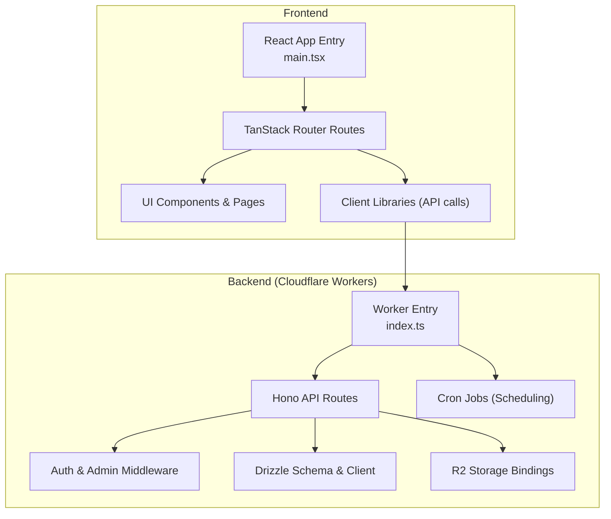

**Diagram sources**
- [src/react-app/main.tsx:1-38](file://src/react-app/main.tsx#L1-L38)
- [src/worker/index.ts:1-71](file://src/worker/index.ts#L1-L71)

**Section sources**
- [package.json:1-98](file://package.json#L1-L98)
- [wrangler.json:1-139](file://wrangler.json#L1-L139)
- [src/react-app/main.tsx:1-38](file://src/react-app/main.tsx#L1-L38)
- [src/worker/index.ts:1-71](file://src/worker/index.ts#L1-L71)

## Core Components
- Frontend runtime: React application bootstrapped with TanStack Router, React Query, theme provider, and auth/audio player contexts.
- Backend runtime: Hono app exposing REST endpoints grouped by feature domains (auth, feed, profile, settings, creator, posts, articles, audio, photography, payments, notifications, courses, admin, library, schedules, discovery).
- Database layer: Drizzle ORM schema defining users, sessions, accounts, verification tokens, posts and related content tables, membership plans/prices, subscription memberships, revenue events, and more.
- Storage: R2 buckets bound for media assets (images, audio, photos, course attachments).
- Payments: Stripe integration for subscriptions, webhooks, and payouts, with sandbox configuration and plan modes.
- Scheduling: Cron-triggered jobs for processing due content schedules and membership maintenance.

**Section sources**
- [src/react-app/main.tsx:1-38](file://src/react-app/main.tsx#L1-L38)
- [src/worker/index.ts:1-71](file://src/worker/index.ts#L1-L71)
- [src/worker/db/schema.ts:1-200](file://src/worker/db/schema.ts#L1-L200)
- [src/worker/db/schema.ts:721-977](file://src/worker/db/schema.ts#L721-L977)
- [wrangler.json:1-139](file://wrangler.json#L1-L139)

## Architecture Overview
Zenith follows a clear separation between the React SPA and the Cloudflare Worker API. The worker serves both static assets and API endpoints, with route-first handling for /api/* paths and asset fallback for single-page routing. Scheduled tasks run on cron triggers to process content publishing queues and membership lifecycle maintenance.

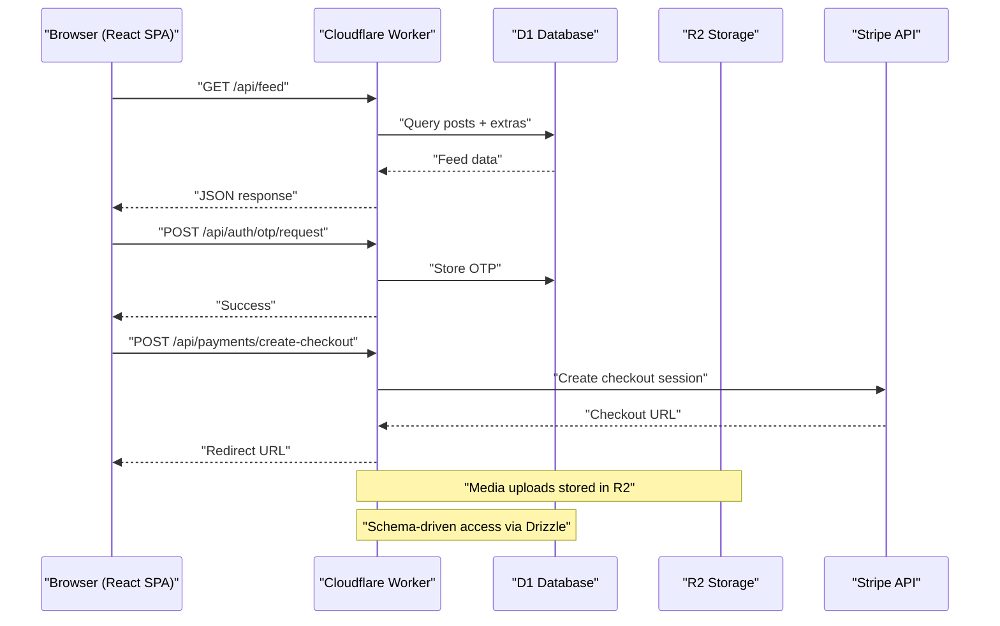

**Diagram sources**
- [src/worker/index.ts:1-71](file://src/worker/index.ts#L1-L71)
- [src/worker/routes/auth.ts:1-200](file://src/worker/routes/auth.ts#L1-L200)
- [wrangler.json:1-139](file://wrangler.json#L1-L139)

## Detailed Component Analysis

### Authentication Flow
Authentication uses email-based OTP sign-in. Users request an OTP, receive an email, then verify to establish a session. Suspended accounts are blocked at key steps.

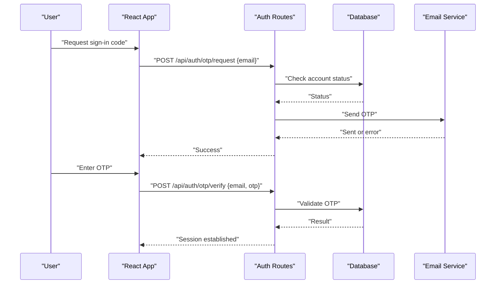

**Diagram sources**
- [src/worker/routes/auth.ts:1-200](file://src/worker/routes/auth.ts#L1-L200)

**Section sources**
- [src/worker/routes/auth.ts:1-200](file://src/worker/routes/auth.ts#L1-L200)

### Posts and Community Features
Posts support rich interactions including replies, likes, polls, and media attachments. Validation ensures safe uploads and consistent data shapes.

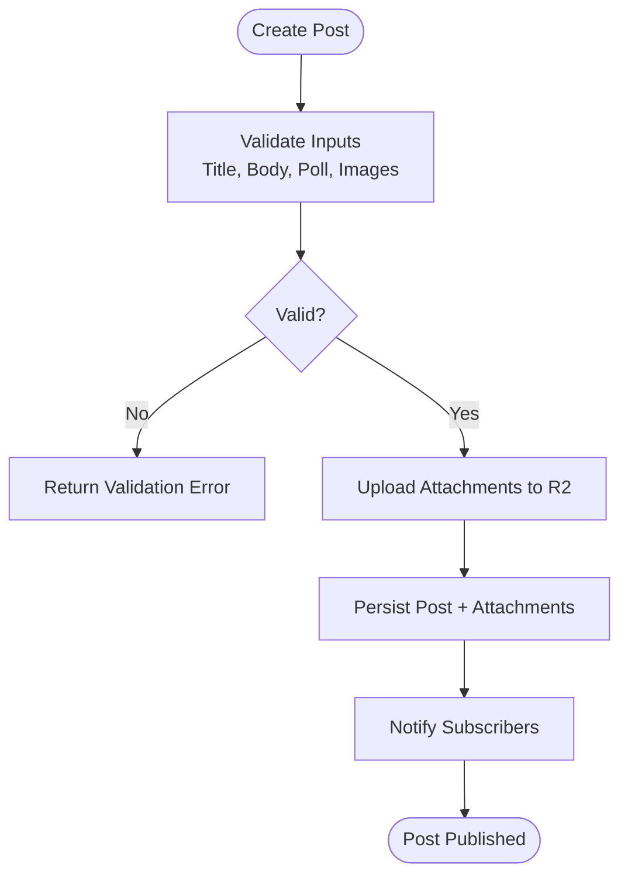

**Diagram sources**
- [src/worker/routes/posts.ts:1-200](file://src/worker/routes/posts.ts#L1-L200)

**Section sources**
- [src/worker/routes/posts.ts:1-200](file://src/worker/routes/posts.ts#L1-L200)

### Articles
Articles are Markdown-based long-form content with optional cover images, excerpts, and draft/published states. They integrate with the same publication pipeline and moderation checks.

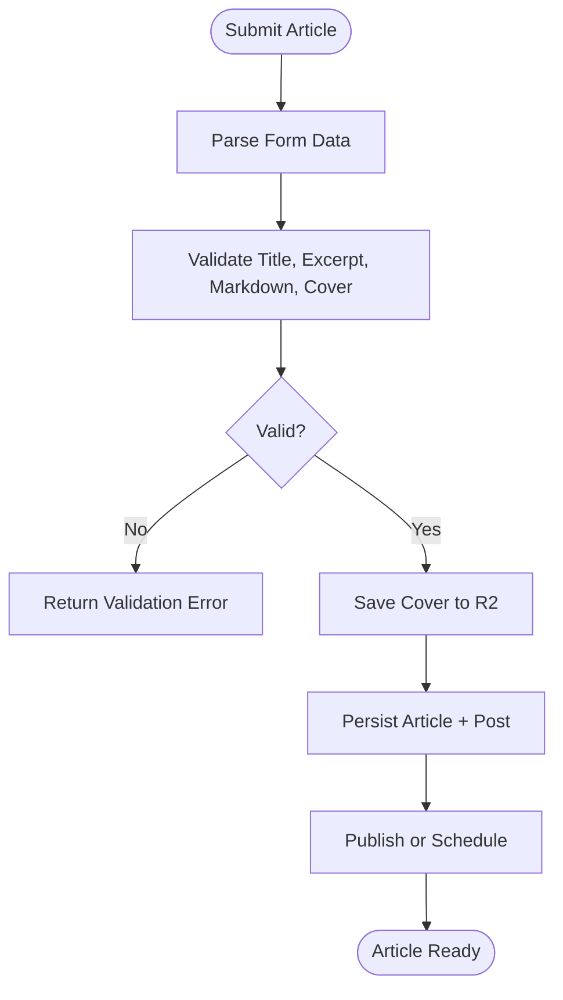

**Diagram sources**
- [src/worker/routes/articles.ts:1-200](file://src/worker/routes/articles.ts#L1-L200)

**Section sources**
- [src/worker/routes/articles.ts:1-200](file://src/worker/routes/articles.ts#L1-L200)

### Audio (Albums and Podcasts)
Audio supports collections (albums/podcasts) and items (music/podcast episodes) with metadata, covers, streaming URLs, and scheduling.

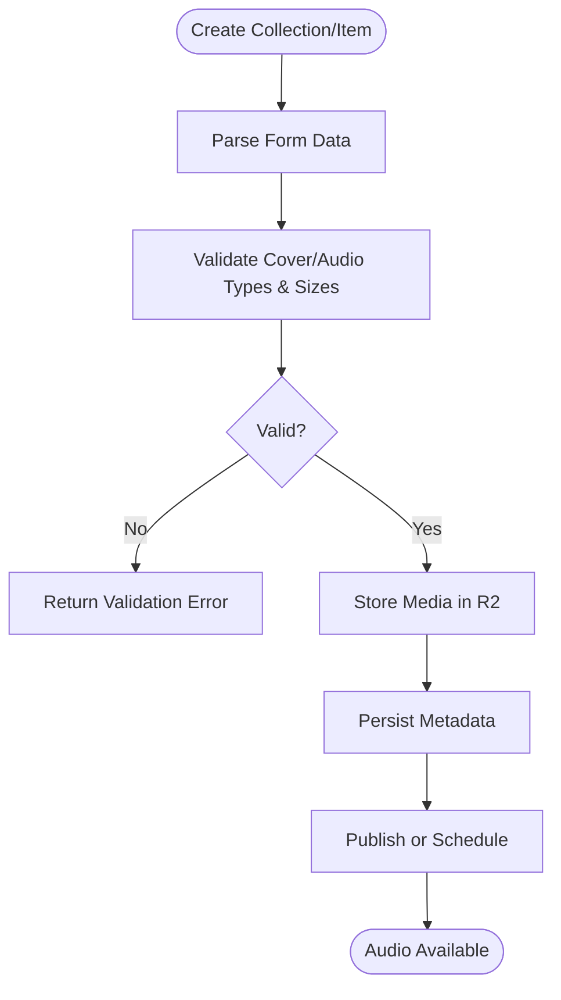

**Diagram sources**
- [src/worker/routes/audio.ts:1-200](file://src/worker/routes/audio.ts#L1-L200)

**Section sources**
- [src/worker/routes/audio.ts:1-200](file://src/worker/routes/audio.ts#L1-L200)

### Photography
Photography albums include preview and original image handling, download controls, and metadata like shoot dates. Supports large files and multiple formats.

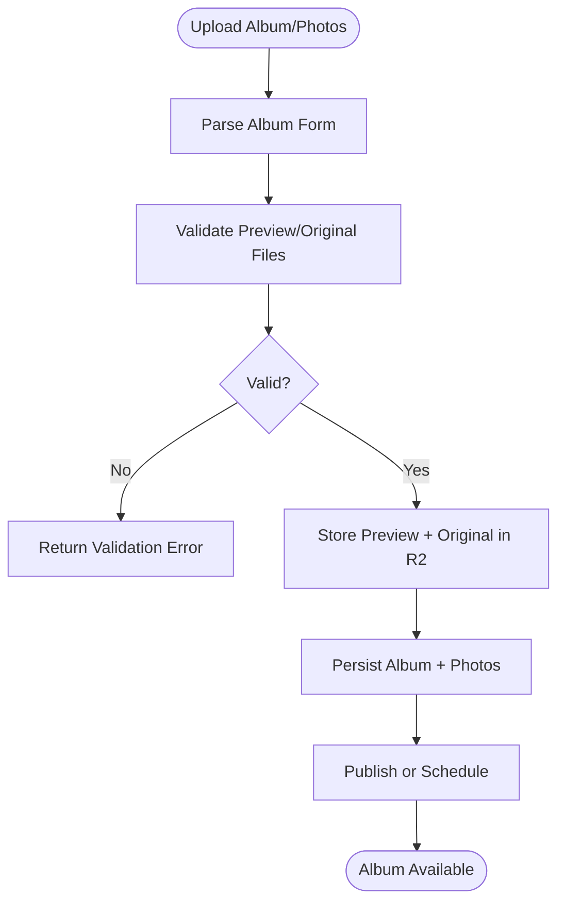

**Diagram sources**
- [src/worker/routes/photography.ts:1-200](file://src/worker/routes/photography.ts#L1-L200)

**Section sources**
- [src/worker/routes/photography.ts:1-200](file://src/worker/routes/photography.ts#L1-L200)

### Courses
Courses provide structured learning with modules, lessons, progress tracking, and large file uploads (video/audio/files) with range requests and multipart completion.

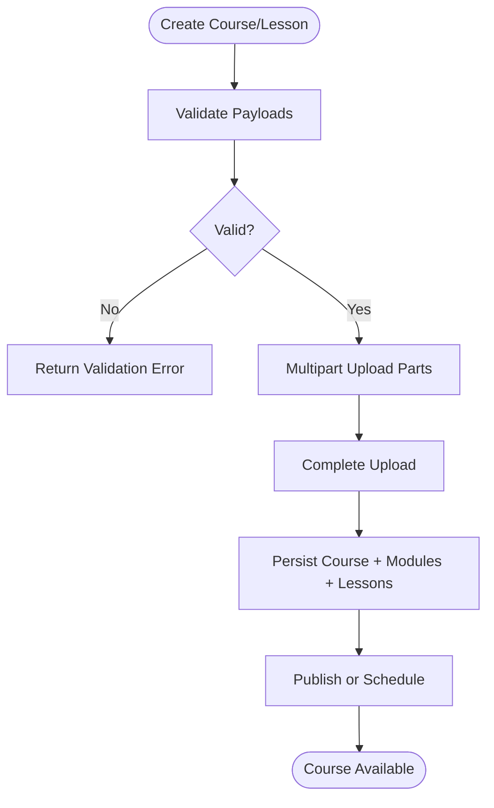

**Diagram sources**
- [src/worker/routes/courses.ts:1-200](file://src/worker/routes/courses.ts#L1-L200)

**Section sources**
- [src/worker/routes/courses.ts:1-200](file://src/worker/routes/courses.ts#L1-L200)

### Monetization System (Stripe Integration)
Monetization supports free permanent, timed free trial, and paid membership modes. Plans and prices are mapped to Stripe products/prices, with sandbox mode validation and webhook event handling.

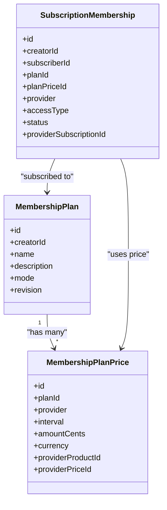

**Diagram sources**
- [src/worker/db/schema.ts:721-977](file://src/worker/db/schema.ts#L721-L977)

**Section sources**
- [src/worker/db/schema.ts:721-977](file://src/worker/db/schema.ts#L721-L977)

### Discovery System
Discovery connects creators with audiences through categories, user interests, and featured creators. It enables personalized feeds and curated listings.

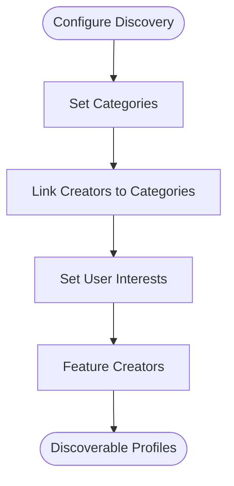

[No sources needed since this diagram shows conceptual workflow, not actual code structure]

**Section sources**
- [src/worker/db/schema.ts:1-200](file://src/worker/db/schema.ts#L1-L200)

### Publication Pipeline
Content across all types goes through a unified publication pipeline that handles moderation, scheduling, and subscriber notifications.

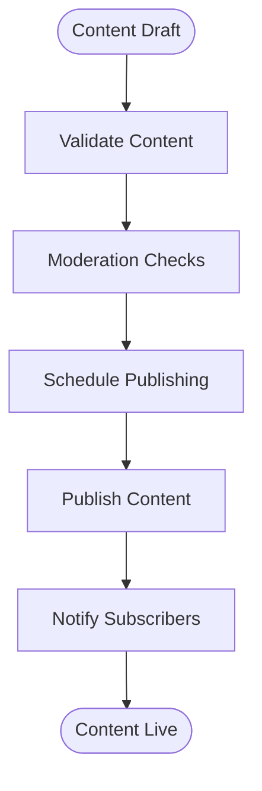

**Diagram sources**
- [src/worker/lib/publication.ts:1-77](file://src/worker/lib/publication.ts#L1-L77)

**Section sources**
- [src/worker/lib/publication.ts:1-77](file://src/worker/lib/publication.ts#L1-L77)

### Conceptual Overview
Zenith serves creators by providing tools to create diverse content, manage audience relationships, and monetize effectively. Audiences benefit from a unified discovery experience and seamless subscription flows. The platform’s modular design allows scaling each content type independently while maintaining consistent UX and performance.

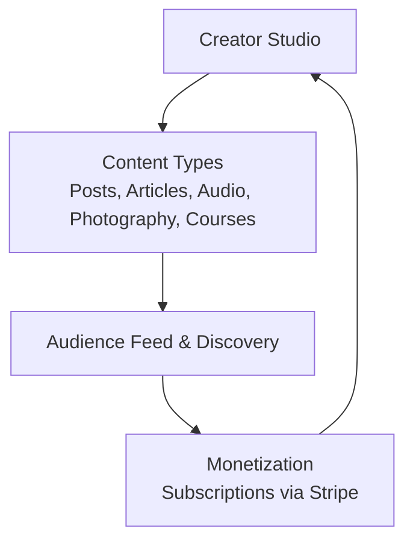

[No sources needed since this diagram shows conceptual workflow, not actual code structure]

## Dependency Analysis
The project integrates several key dependencies:
- Frontend: React, TanStack Router, React Query, Tailwind CSS, Shadcn UI, Next Themes.
- Backend: Hono, Drizzle ORM, Better Auth, Zod validators, Stripe SDK.
- Infrastructure: Cloudflare Workers, D1 (SQLite), R2 (object storage), Wrangler for deployment.

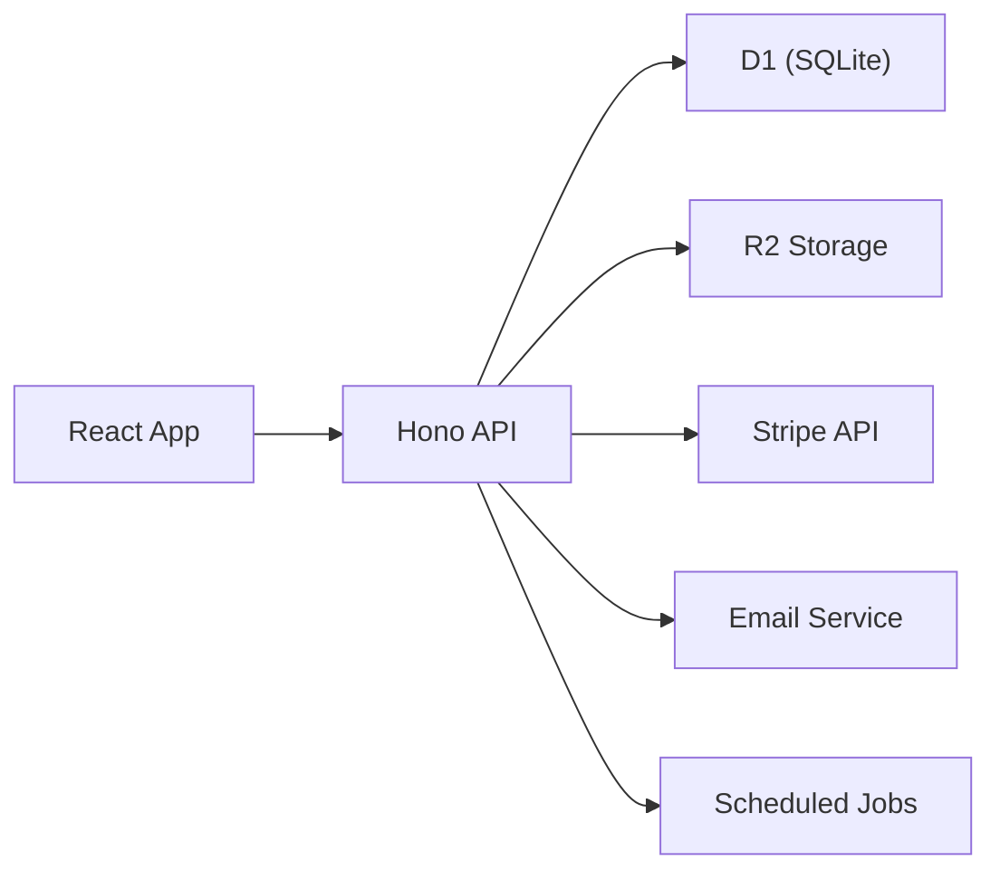

**Diagram sources**
- [package.json:1-98](file://package.json#L1-L98)
- [wrangler.json:1-139](file://wrangler.json#L1-L139)

**Section sources**
- [package.json:1-98](file://package.json#L1-L98)
- [wrangler.json:1-139](file://wrangler.json#L1-L139)

## Performance Considerations
- Use Cloudflare Workers for low-latency API responses and edge caching where appropriate.
- Optimize media uploads with R2 and implement chunked uploads for large files (courses).
- Leverage Drizzle ORM queries with selective fields and indexes defined in the schema.
- Implement pagination and filtering for feed and discovery endpoints.
- Cache frequently accessed data (e.g., creator profiles, categories) using in-memory caches or CDN strategies.
- Monitor scheduled job performance and retry policies for robustness.

[No sources needed since this section provides general guidance]

## Troubleshooting Guide
Common issues and resolutions:
- Authentication failures: Ensure OTP emails are deliverable and accounts are not suspended. Check error codes returned by OTP endpoints.
- Media upload errors: Validate file types and sizes before upload. Confirm R2 bucket bindings and permissions.
- Payment webhook failures: Verify Stripe sandbox configuration and secret keys. Inspect webhook event logs and mapping logic.
- Scheduling delays: Review cron triggers and job queues. Check nextAttemptAt and attemptCount fields for stuck entries.

**Section sources**
- [src/worker/routes/auth.ts:1-200](file://src/worker/routes/auth.ts#L1-L200)
- [wrangler.json:1-139](file://wrangler.json#L1-L139)

## Conclusion
Zenith delivers a comprehensive creator network platform with a modern, scalable architecture. Its separation of concerns, robust content pipelines, and integrated monetization make it suitable for creators seeking to build and sustain engaged audiences. The use of Cloudflare Workers, Hono, Drizzle ORM, and React ensures high performance, developer productivity, and maintainability.

[No sources needed since this section summarizes without analyzing specific files]