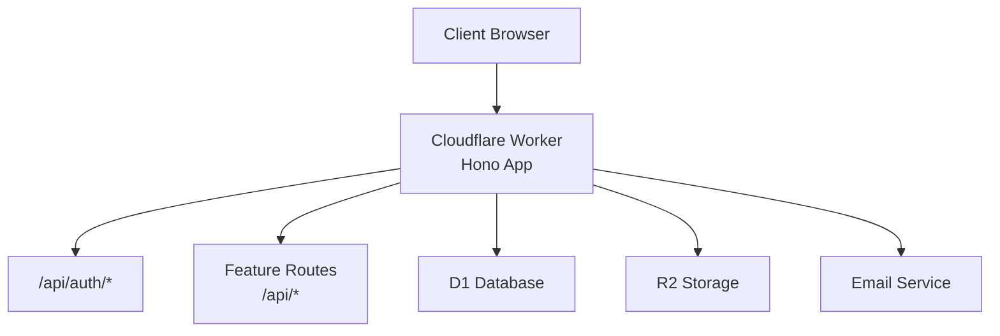
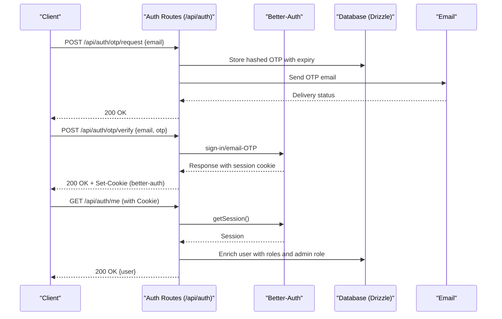
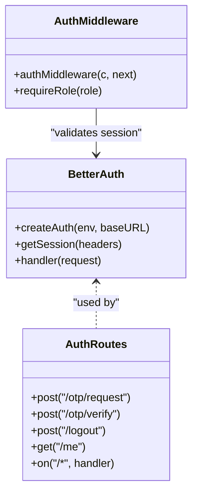
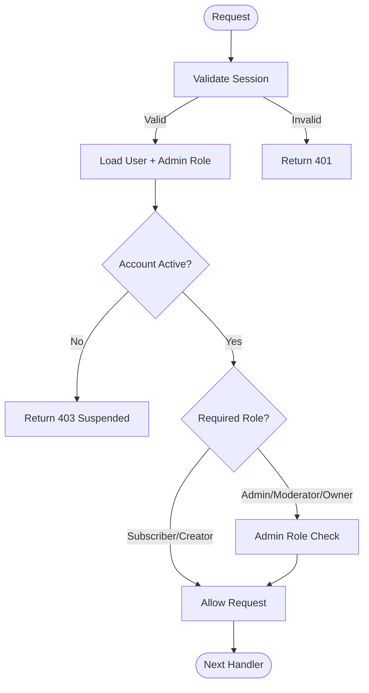
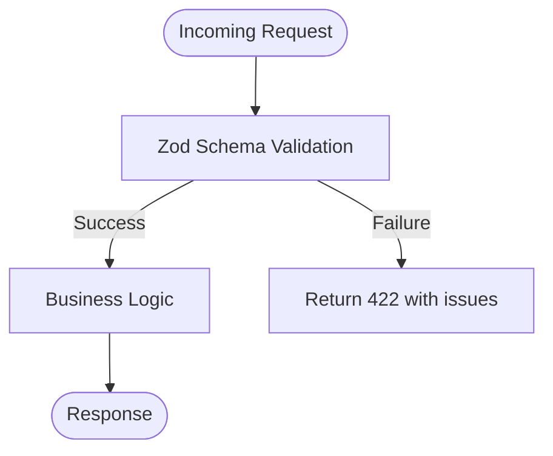
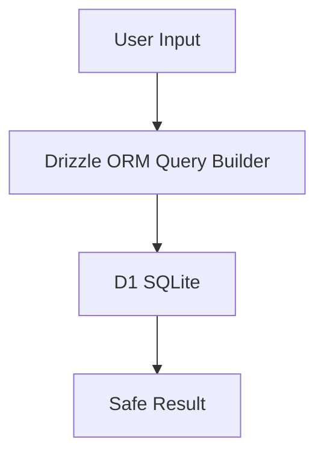
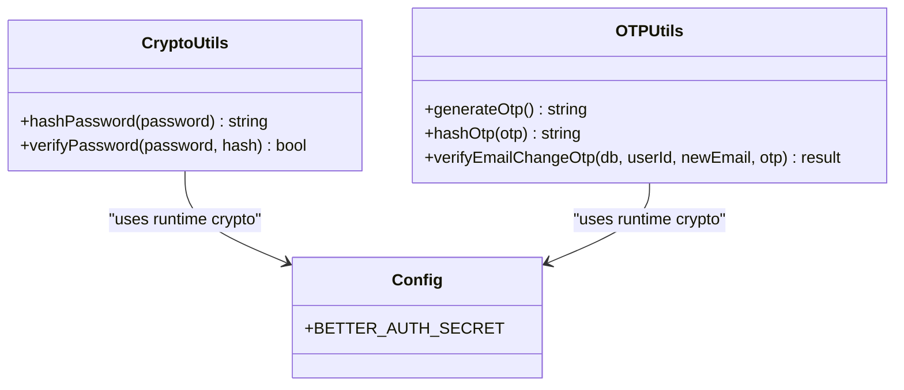
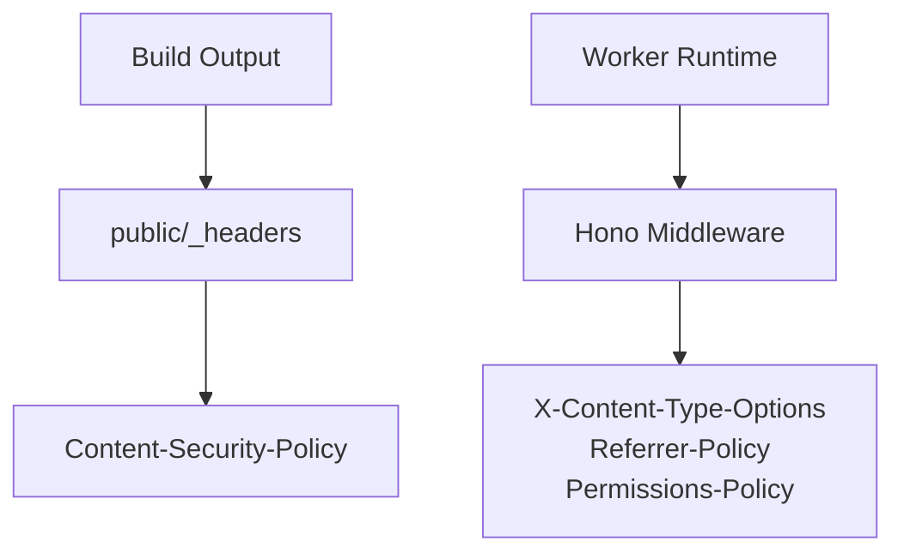
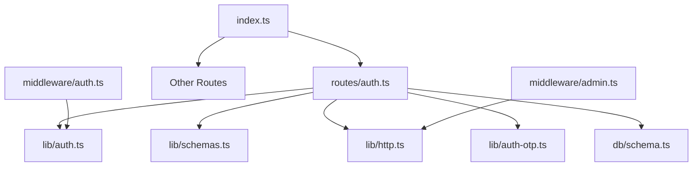

# Security Guide

<cite>
**Referenced Files in This Document**
- [index.ts](file://src/worker/index.ts)
- [auth.ts](file://src/worker/lib/auth.ts)
- [auth-middleware.ts](file://src/worker/middleware/auth.ts)
- [admin-middleware.ts](file://src/worker/middleware/admin.ts)
- [auth-routes.ts](file://src/worker/routes/auth.ts)
- [schemas.ts](file://src/worker/lib/schemas.ts)
- [crypto.ts](file://src/worker/lib/crypto.ts)
- [auth-otp.ts](file://src/worker/lib/auth-otp.ts)
- [http.ts](file://src/worker/lib/http.ts)
- [schema.ts](file://src/worker/db/schema.ts)
- [wrangler.json](file://wrangler.json)
- [003-apply-browser-security-headers.md](file://plans/003-apply-browser-security-headers.md)
</cite>

## Table of Contents
1. Introduction
2. Project Structure
3. Core Components
4. Architecture Overview
5. Detailed Component Analysis
6. Dependency Analysis
7. Performance Considerations
8. Troubleshooting Guide
9. Conclusion
10. Appendices

## Introduction
This Security Guide documents the security posture and practices of the Zenith application, focusing on authentication and authorization using Better-Auth, session management, role-based access control, input validation with Zod, SQL injection prevention via parameterized queries, XSS protections, data protection (encryption at rest/in transit, secure password handling, sensitive data masking), API security (rate limiting, CORS, request signing), security headers and Content Security Policy, cookie configuration, vulnerability mitigations, audit procedures, incident response guidelines, and development best practices.

## Project Structure
Zenith is a Cloudflare Worker application built with Hono. The worker entrypoint mounts feature routes under /api/* and serves static assets from a client build. Authentication flows are implemented through Better-Auth with email OTP sign-in, while middleware enforces authentication and role checks. Input validation is centralized with Zod schemas. Database interactions use Drizzle ORM for type-safe, parameterized queries.

**Section sources**
- [index.ts:24-45](file://src/worker/index.ts#L24-L45)
- [wrangler.json:26-33](file://wrangler.json#L26-L33)

## Core Components
- Authentication and Session Management: Better-Auth configured with email OTP plugin, session storage via Drizzle adapter, and custom OTP lifecycle.
- Authorization: Middleware validates sessions and enriches user context; role-based guards enforce subscriber/creator roles and admin roles.
- Input Validation: Zod schemas validate all incoming payloads and parameters.
- Data Protection: PBKDF2 password hashing utilities; OTP hashing and constant-time comparison; secrets managed via Wrangler secrets.
- API Error Handling: Centralized error responses and validation hooks.

**Section sources**
- [auth.ts:9-77](file://src/worker/lib/auth.ts#L9-L77)
- [auth-middleware.ts:23-56](file://src/worker/middleware/auth.ts#L23-L56)
- [auth-routes.ts:135-212](file://src/worker/routes/auth.ts#L135-L212)
- [schemas.ts:1-221](file://src/worker/lib/schemas.ts#L1-L221)
- [crypto.ts:25-108](file://src/worker/lib/crypto.ts#L25-L108)
- [auth-otp.ts:26-124](file://src/worker/lib/auth-otp.ts#L26-L124)
- [http.ts:23-80](file://src/worker/lib/http.ts#L23-L80)

## Architecture Overview
The authentication flow uses email OTP to create or sign in users, sets Better-Auth cookies, and enriches the request context with user identity and roles. Subsequent requests pass through auth middleware to verify sessions and enforce permissions.

**Diagram sources**
- [auth-routes.ts:135-212](file://src/worker/routes/auth.ts#L135-L212)
- [auth.ts:9-77](file://src/worker/lib/auth.ts#L9-L77)
- [auth-middleware.ts:23-56](file://src/worker/middleware/auth.ts#L23-L56)

**Section sources**
- [auth-routes.ts:135-212](file://src/worker/routes/auth.ts#L135-L212)
- [auth-middleware.ts:23-56](file://src/worker/middleware/auth.ts#L23-L56)

## Detailed Component Analysis

### Authentication and Session Management (Better-Auth)
- Better-Auth is initialized with a Drizzle adapter and email OTP plugin. Password login is disabled; sign-in occurs via OTP sent to email.
- Sessions are stored in the database and validated per request. Cookies are propagated to responses.
- Native Better-Auth endpoints are proxied except for blocked paths that could allow self-assignment of privileged roles.

**Diagram sources**
- [auth.ts:9-77](file://src/worker/lib/auth.ts#L9-L77)
- [auth-routes.ts:135-212](file://src/worker/routes/auth.ts#L135-L212)
- [auth-middleware.ts:23-56](file://src/worker/middleware/auth.ts#L23-L56)

**Section sources**
- [auth.ts:9-77](file://src/worker/lib/auth.ts#L9-L77)
- [auth-routes.ts:135-212](file://src/worker/routes/auth.ts#L135-L212)
- [auth-middleware.ts:23-56](file://src/worker/middleware/auth.ts#L23-L56)

### Role-Based Access Control
- User roles include subscriber and creator; admin roles include owner and moderator.
- Middleware enforces account status and suspensions; additional admin middleware restricts actions based on admin role.
- Role checks prevent unauthorized operations and ensure least privilege.

**Diagram sources**
- [auth-middleware.ts:23-56](file://src/worker/middleware/auth.ts#L23-L56)
- [admin-middleware.ts:5-13](file://src/worker/middleware/admin.ts#L5-L13)

**Section sources**
- [auth-middleware.ts:23-56](file://src/worker/middleware/auth.ts#L23-L56)
- [admin-middleware.ts:5-13](file://src/worker/middleware/admin.ts#L5-L13)

### Input Validation and Sanitization (Zod)
- All API inputs are validated using Zod schemas before processing.
- Schemas enforce email formats, OTP digit constraints, length limits, URL protocols, and numeric ranges.
- Validation errors return structured JSON with details.

**Diagram sources**
- [schemas.ts:1-221](file://src/worker/lib/schemas.ts#L1-L221)
- [http.ts:77-80](file://src/worker/lib/http.ts#L77-L80)

**Section sources**
- [schemas.ts:1-221](file://src/worker/lib/schemas.ts#L1-L221)
- [http.ts:77-80](file://src/worker/lib/http.ts#L77-L80)

### SQL Injection Prevention (Parameterized Queries)
- All database interactions use Drizzle ORM, which generates parameterized queries.
- No raw SQL concatenation is used for user-supplied values; filters and joins rely on ORM methods.

**Section sources**
- [schema.ts:5-32](file://src/worker/db/schema.ts#L5-L32)
- [auth-routes.ts:135-164](file://src/worker/routes/auth.ts#L135-L164)

### XSS Protection Measures
- Responses are JSON where applicable; CSP and MIME sniffing protections are planned via headers.
- External links use safe attributes; content rendering should avoid unsafe HTML unless sanitized.

[No sources needed since this section provides general guidance]

### Data Protection
- Password Hashing: PBKDF2-HMAC-SHA256 with salt and iteration count; constant-time verification.
- OTP Security: SHA-256 hashing, constant-time comparison, limited attempts, expiration.
- Secrets Management: Better-Auth secret and other secrets defined as Wrangler secrets.
- Encryption in Transit: HTTPS enforced by Cloudflare; cookies set over secure channels.

**Diagram sources**
- [crypto.ts:25-108](file://src/worker/lib/crypto.ts#L25-L108)
- [auth-otp.ts:26-124](file://src/worker/lib/auth-otp.ts#L26-L124)
- [wrangler.json:84-90](file://wrangler.json#L84-L90)

**Section sources**
- [crypto.ts:25-108](file://src/worker/lib/crypto.ts#L25-L108)
- [auth-otp.ts:26-124](file://src/worker/lib/auth-otp.ts#L26-L124)
- [wrangler.json:84-90](file://wrangler.json#L84-L90)

### API Security Practices
- Rate Limiting: Not explicitly implemented in the analyzed files; consider adding rate limiting for OTP endpoints and sensitive routes.
- CORS: Better-Auth configured with trustedOrigins; ensure origin validation aligns with deployment domains.
- Request Signing: Not present; consider signing critical requests if required by external integrations.

**Section sources**
- [auth.ts:12-16](file://src/worker/lib/auth.ts#L12-L16)

### Security Headers and Content Security Policy
- Plan exists to apply baseline browser security headers and CSP for both static assets and API responses.
- Static headers via public/_headers; API headers via Hono middleware.

**Diagram sources**
- [003-apply-browser-security-headers.md:76-102](file://plans/003-apply-browser-security-headers.md#L76-L102)

**Section sources**
- [003-apply-browser-security-headers.md:76-102](file://plans/003-apply-browser-security-headers.md#L76-L102)

### Secure Cookie Settings
- Better-Auth manages session cookies; ensure cookies are set with appropriate flags (Secure, HttpOnly, SameSite) aligned with production requirements.
- Current implementation propagates Set-Cookie headers from Better-Auth responses.

**Section sources**
- [auth-routes.ts:24-41](file://src/worker/routes/auth.ts#L24-L41)

## Dependency Analysis
The worker composes multiple modules: routes, middleware, libraries, and database schema. Dependencies are layered to maintain separation of concerns and reduce coupling.

**Diagram sources**
- [index.ts:24-45](file://src/worker/index.ts#L24-L45)
- [auth-routes.ts:1-14](file://src/worker/routes/auth.ts#L1-L14)
- [auth-middleware.ts:1-14](file://src/worker/middleware/auth.ts#L1-L14)
- [admin-middleware.ts:1-14](file://src/worker/middleware/admin.ts#L1-L14)

**Section sources**
- [index.ts:24-45](file://src/worker/index.ts#L24-L45)

## Performance Considerations
- OTP generation and hashing are lightweight; ensure OTP store cleanup avoids unnecessary scans.
- Parameterized queries via Drizzle minimize overhead and improve safety.
- Avoid heavy cryptographic operations in hot paths; prefer asynchronous operations where possible.

[No sources needed since this section provides general guidance]

## Troubleshooting Guide
- Common Errors:
  - Validation failures return 422 with detailed issues.
  - Unauthorized requests return 401; forbidden returns 403.
  - Suspended accounts return 403 with specific code.
- Debugging Steps:
  - Inspect Zod validation issues via error responses.
  - Verify Better-Auth session retrieval and cookie propagation.
  - Check OTP store entries and expiration times.

**Section sources**
- [http.ts:23-80](file://src/worker/lib/http.ts#L23-L80)
- [auth-routes.ts:135-212](file://src/worker/routes/auth.ts#L135-L212)

## Conclusion
Zenith implements robust authentication and authorization patterns using Better-Auth and Hono middleware, strong input validation with Zod, and secure data handling practices. While foundational security measures are in place, additional hardening such as explicit rate limiting, comprehensive CSP enforcement, and secure cookie configuration should be prioritized. Regular audits and adherence to development best practices will further strengthen the application’s security posture.

[No sources needed since this section summarizes without analyzing specific files]

## Appendices

### Security Best Practices for Development
- Use environment variables and secrets for sensitive configuration.
- Enforce strict input validation and output encoding.
- Prefer parameterized queries and ORM abstractions.
- Implement consistent error responses and logging.
- Review and update CSP regularly as dependencies evolve.

[No sources needed since this section provides general guidance]

### Code Review Processes for Security-Sensitive Changes
- Require peer review for changes affecting authentication, authorization, and data handling.
- Validate new dependencies for known vulnerabilities.
- Ensure tests cover security-critical paths (validation, role checks, OTP flows).

[No sources needed since this section provides general guidance]

### Regular Security Assessments
- Conduct periodic penetration testing and dependency audits.
- Monitor logs for suspicious activity and anomalies.
- Update policies and configurations based on findings.

[No sources needed since this section provides general guidance]