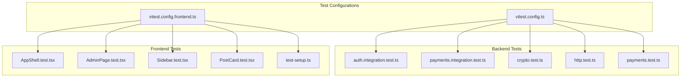
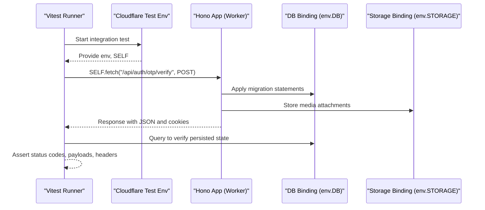
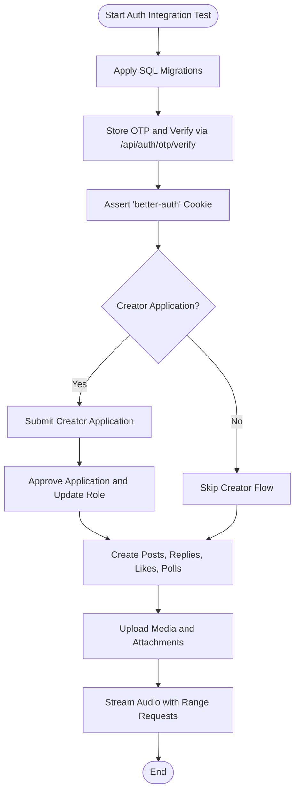
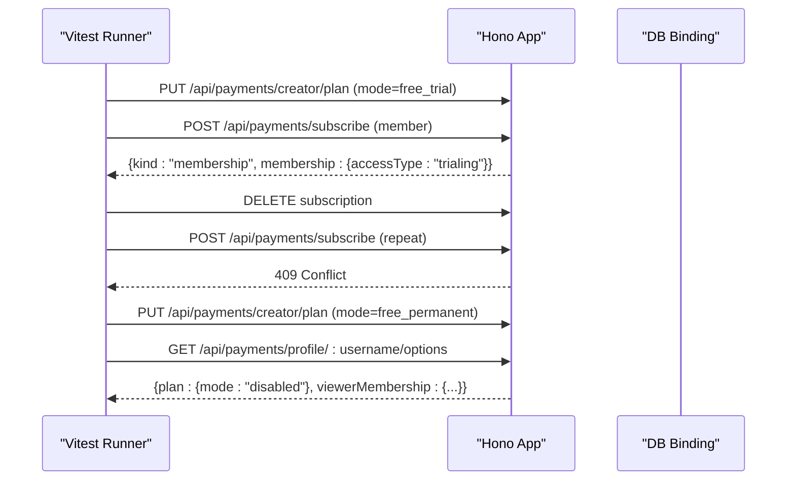
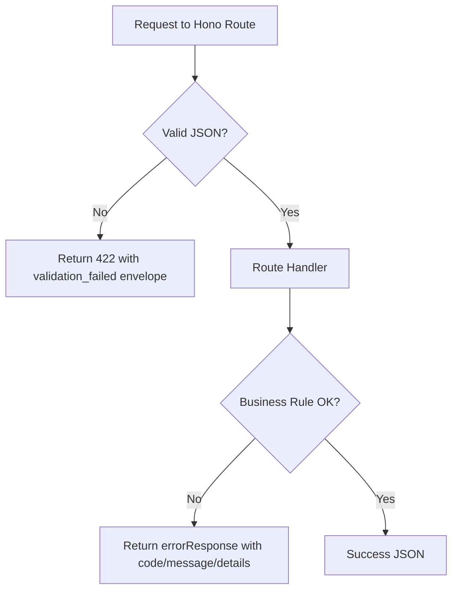
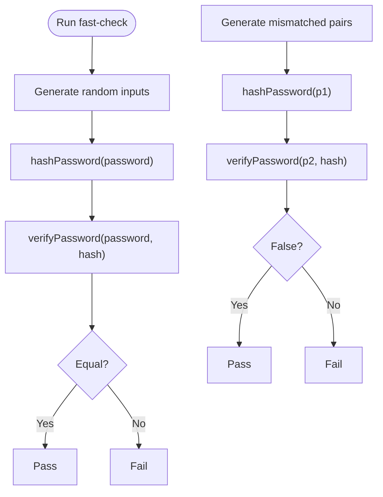
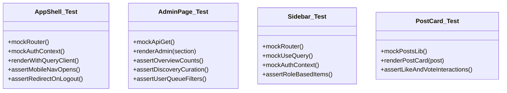
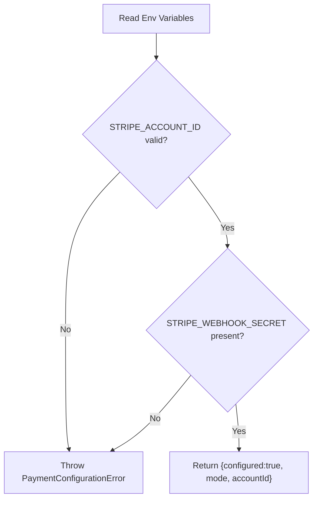
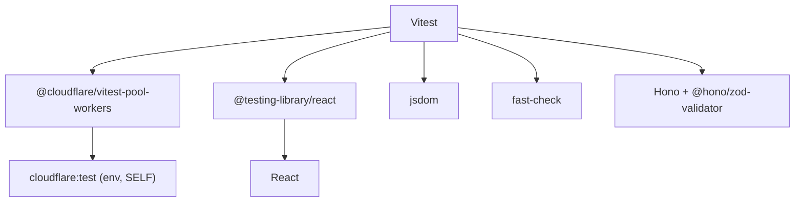

# Testing Strategy

<cite>
**Referenced Files in This Document**
- [vitest.config.ts](file://vitest.config.ts)
- [vitest.config.frontend.ts](file://vitest.config.frontend.ts)
- [package.json](file://package.json)
- [test-setup.ts](file://src/react-app/test-setup.ts)
- [auth.integration.test.ts](file://src/worker/routes/auth.integration.test.ts)
- [payments.integration.test.ts](file://src/worker/routes/payments.integration.test.ts)
- [crypto.test.ts](file://src/worker/lib/crypto.test.ts)
- [http.test.ts](file://src/worker/lib/http.test.ts)
- [AppShell.test.tsx](file://src/react-app/components/AppShell.test.tsx)
- [AdminPage.test.tsx](file://src/react-app/pages/AdminPage.test.tsx)
- [Sidebar.test.tsx](file://src/react-app/components/Sidebar.test.tsx)
- [PostCard.test.tsx](file://src/react-app/components/PostCard.test.tsx)
- [payments.test.ts](file://src/worker/routes/payments.test.ts)
- [config.ts](file://src/worker/lib/payments/config.ts)
</cite>

## Table of Contents
1. [Introduction](#introduction)
2. [Project Structure](#project-structure)
3. [Core Components](#core-components)
4. [Architecture Overview](#architecture-overview)
5. [Detailed Component Analysis](#detailed-component-analysis)
6. [Dependency Analysis](#dependency-analysis)
7. [Performance Considerations](#performance-considerations)
8. [Troubleshooting Guide](#troubleshooting-guide)
9. [Conclusion](#conclusion)

## Introduction
This document explains the testing strategy for the Zenith application, which runs on Cloudflare Workers and includes a React frontend. It covers unit tests, integration tests, and component tests using Vitest. It also documents test organization patterns, mocking strategies for external dependencies (Cloudflare services and Stripe), utilities available in the codebase, and guidance for continuous integration, performance/load testing, and debugging.

## Project Structure
The project uses two separate Vitest configurations:
- Backend (Workers) tests are configured to run with the Cloudflare Workers pool and include worker-side files.
- Frontend (React) tests run in a jsdom environment with React-specific setup and aliases.

**Diagram sources**
- [vitest.config.ts:1-14](file://vitest.config.ts#L1-L14)
- [vitest.config.frontend.ts:1-19](file://vitest.config.frontend.ts#L1-L19)
- [auth.integration.test.ts:1-609](file://src/worker/routes/auth.integration.test.ts#L1-L609)
- [payments.integration.test.ts:1-114](file://src/worker/routes/payments.integration.test.ts#L1-L114)
- [crypto.test.ts:1-50](file://src/worker/lib/crypto.test.ts#L1-L50)
- [http.test.ts:1-42](file://src/worker/lib/http.test.ts#L1-L42)
- [payments.test.ts:1-24](file://src/worker/routes/payments.test.ts#L1-L24)
- [AppShell.test.tsx:1-109](file://src/react-app/components/AppShell.test.tsx#L1-L109)
- [AdminPage.test.tsx:1-80](file://src/react-app/pages/AdminPage.test.tsx#L1-L80)
- [Sidebar.test.tsx:1-57](file://src/react-app/components/Sidebar.test.tsx#L1-L57)
- [PostCard.test.tsx:1-41](file://src/react-app/components/PostCard.test.tsx#L1-L41)
- [test-setup.ts:1-10](file://src/react-app/test-setup.ts#L1-L10)

**Section sources**
- [vitest.config.ts:1-14](file://vitest.config.ts#L1-L14)
- [vitest.config.frontend.ts:1-19](file://vitest.config.frontend.ts#L1-L19)
- [package.json:83-95](file://package.json#L83-L95)

## Core Components
- Test runners and environments
  - Backend tests use the Cloudflare Workers pool via @cloudflare/vitest-pool-workers and import cloudflare:test bindings (env, SELF).
  - Frontend tests run in jsdom with React plugin and a global setup file that polyfills ResizeObserver.
- Assertions and libraries
  - Vitest provides assertions and mocking (vi.fn, vi.mock).
  - React Testing Library is used for rendering and user interactions.
  - fast-check is used for property-based tests in backend crypto logic.
- External service mocking
  - Cloudflare DB and STORAGE are accessed through env.DB and env.STORAGE in integration tests.
  - Stripe configuration is validated via dedicated helpers; tests assert behavior under different modes without calling Stripe directly.

Key implementation references:
- Backend test runner configuration and inclusion pattern
- Frontend test runner configuration, jsdom environment, and setup file
- Integration tests applying migrations and exercising endpoints via SELF.fetch
- Unit tests validating error envelopes and validation hooks
- Property-based tests for password hashing and verification
- React component tests mocking router, query client, and auth context

**Section sources**
- [vitest.config.ts:1-14](file://vitest.config.ts#L1-L14)
- [vitest.config.frontend.ts:1-19](file://vitest.config.frontend.ts#L1-L19)
- [test-setup.ts:1-10](file://src/react-app/test-setup.ts#L1-L10)
- [auth.integration.test.ts:1-609](file://src/worker/routes/auth.integration.test.ts#L1-L609)
- [payments.integration.test.ts:1-114](file://src/worker/routes/payments.integration.test.ts#L1-L114)
- [crypto.test.ts:1-50](file://src/worker/lib/crypto.test.ts#L1-L50)
- [http.test.ts:1-42](file://src/worker/lib/http.test.ts#L1-L42)
- [AppShell.test.tsx:1-109](file://src/react-app/components/AppShell.test.tsx#L1-L109)
- [AdminPage.test.tsx:1-80](file://src/react-app/pages/AdminPage.test.tsx#L1-L80)
- [Sidebar.test.tsx:1-57](file://src/react-app/components/Sidebar.test.tsx#L1-L57)
- [PostCard.test.tsx:1-41](file://src/react-app/components/PostCard.test.tsx#L1-L41)

## Architecture Overview
The testing architecture separates concerns by environment and scope:
- Backend integration tests exercise full request/response flows against Hono routes, apply SQL migrations to an in-memory or test-bound database, and assert state changes in DB and storage.
- Backend unit tests validate helper functions and error handling paths.
- Frontend component tests render UI components in jsdom, mock network calls and routing, and simulate user interactions.

**Diagram sources**
- [auth.integration.test.ts:1-609](file://src/worker/routes/auth.integration.test.ts#L1-L609)
- [payments.integration.test.ts:1-114](file://src/worker/routes/payments.integration.test.ts#L1-L114)

## Detailed Component Analysis

### Backend Integration Tests (Auth Flow)
Integration tests bootstrap the schema by applying all Drizzle SQL migrations, then exercise authentication and content workflows end-to-end. They:
- Use cloudflare:test bindings to access DB and Storage.
- Create users via OTP sign-in and assert cookie presence.
- Validate role transitions and permissions after creator approval.
- Exercise posts, replies, likes, polls, audio streaming (range requests), and photography albums.

**Diagram sources**
- [auth.integration.test.ts:1-609](file://src/worker/routes/auth.integration.test.ts#L1-L609)

**Section sources**
- [auth.integration.test.ts:1-609](file://src/worker/routes/auth.integration.test.ts#L1-L609)

### Backend Integration Tests (Payments/Membership Modes)
These tests validate membership mode behaviors:
- One-time trials enforced and repeated trial attempts blocked.
- Grandfathering permanent free access when plan mode switches.
- Profile options reflect current plan and entitlements.

**Diagram sources**
- [payments.integration.test.ts:1-114](file://src/worker/routes/payments.integration.test.ts#L1-L114)

**Section sources**
- [payments.integration.test.ts:1-114](file://src/worker/routes/payments.integration.test.ts#L1-L114)

### Backend Unit Tests (HTTP Error Helpers and Validation)
Unit tests ensure consistent error envelopes and validation failures:
- Standardized error responses with code, message, and details.
- Validation hook returns 422 with structured issues.

**Diagram sources**
- [http.test.ts:1-42](file://src/worker/lib/http.test.ts#L1-L42)

**Section sources**
- [http.test.ts:1-42](file://src/worker/lib/http.test.ts#L1-L42)

### Backend Unit Tests (Crypto Property-Based)
Property-based tests validate cryptographic behavior across many inputs:
- Password hash round-trip succeeds.
- Wrong passwords always fail verification.
- Malformed hashes are rejected.

**Diagram sources**
- [crypto.test.ts:1-50](file://src/worker/lib/crypto.test.ts#L1-L50)

**Section sources**
- [crypto.test.ts:1-50](file://src/worker/lib/crypto.test.ts#L1-L50)

### Frontend Component Tests (AppShell, AdminPage, Sidebar, PostCard)
Component tests demonstrate common patterns:
- Mock TanStack Router and React Query providers.
- Mock auth context and API modules.
- Render components with QueryClientProvider and assert UI states and interactions.

**Diagram sources**
- [AppShell.test.tsx:1-109](file://src/react-app/components/AppShell.test.tsx#L1-L109)
- [AdminPage.test.tsx:1-80](file://src/react-app/pages/AdminPage.test.tsx#L1-L80)
- [Sidebar.test.tsx:1-57](file://src/react-app/components/Sidebar.test.tsx#L1-L57)
- [PostCard.test.tsx:1-41](file://src/react-app/components/PostCard.test.tsx#L1-L41)

**Section sources**
- [AppShell.test.tsx:1-109](file://src/react-app/components/AppShell.test.tsx#L1-L109)
- [AdminPage.test.tsx:1-80](file://src/react-app/pages/AdminPage.test.tsx#L1-L80)
- [Sidebar.test.tsx:1-57](file://src/react-app/components/Sidebar.test.tsx#L1-L57)
- [PostCard.test.tsx:1-41](file://src/react-app/components/PostCard.test.tsx#L1-L41)

### Stripe Configuration and Mode Handling
Stripe-related configuration is validated via helpers that enforce required environment variables and expected formats. Tests assert behavior based on these validations and route internals mapping Stripe statuses to membership statuses.

**Diagram sources**
- [config.ts:43-63](file://src/worker/lib/payments/config.ts#L43-L63)

**Section sources**
- [payments.test.ts:1-24](file://src/worker/routes/payments.test.ts#L1-L24)
- [config.ts:43-63](file://src/worker/lib/payments/config.ts#L43-L63)

## Dependency Analysis
Testing dependencies and their roles:
- Vitest orchestrates tests and provides assertion/mocking APIs.
- Cloudflare vitest pool enables Worker-like execution and bindings.
- React Testing Library and jsdom provide DOM simulation for component tests.
- fast-check generates randomized inputs for property-based tests.
- Hono’s zValidator and Zod schemas drive validation behavior tested in unit tests.

**Diagram sources**
- [vitest.config.ts:1-14](file://vitest.config.ts#L1-L14)
- [vitest.config.frontend.ts:1-19](file://vitest.config.frontend.ts#L1-L19)
- [package.json:58-81](file://package.json#L58-L81)

**Section sources**
- [vitest.config.ts:1-14](file://vitest.config.ts#L1-L14)
- [vitest.config.frontend.ts:1-19](file://vitest.config.frontend.ts#L1-L19)
- [package.json:58-81](file://package.json#L58-L81)

## Performance Considerations
- Keep integration tests focused on critical paths to avoid long runtimes.
- Reuse shared migration application helpers to reduce duplication and speed up setup.
- Prefer minimal data generation in tests; use deterministic fixtures where possible.
- For load/performance testing:
  - Use external tools (e.g., k6, Artillery) to simulate concurrent requests against deployed endpoints.
  - Measure response times, error rates, and resource usage on Cloudflare dashboard.
  - Focus on hot paths like media streaming and large payload uploads.
- Avoid heavy async operations in unit tests; isolate pure functions and helpers.

[No sources needed since this section provides general guidance]

## Troubleshooting Guide
Common issues and resolutions:
- Missing cloudflare:test bindings
  - Ensure tests run with the Cloudflare Workers pool and wrangler config path is correct.
- Database migrations failing
  - Confirm migration files are imported with raw loader and statements are split correctly before executing.
- Cookie parsing inconsistencies
  - Use robust header parsing to handle set-cookie arrays and multiple cookies.
- React component tests failing due to missing globals
  - Polyfill ResizeObserver in setup file to prevent errors in jsdom.
- Network mocks not applied
  - Ensure vi.mock is called at module level and imports match actual module paths.

**Section sources**
- [vitest.config.ts:1-14](file://vitest.config.ts#L1-L14)
- [vitest.config.frontend.ts:1-19](file://vitest.config.frontend.ts#L1-L19)
- [test-setup.ts:1-10](file://src/react-app/test-setup.ts#L1-L10)
- [auth.integration.test.ts:1-609](file://src/worker/routes/auth.integration.test.ts#L1-L609)

## Conclusion
Zenith’s testing strategy leverages Vitest with specialized pools for Workers and jsdom for React components. Integration tests exercise full request/response flows with real DB and storage bindings, while unit and component tests isolate behavior through precise mocking. The approach balances reliability and speed, supports complex workflows (auth, payments, media), and provides clear patterns for maintaining coverage and debugging in a Cloudflare Workers environment.

[No sources needed since this section summarizes without analyzing specific files]