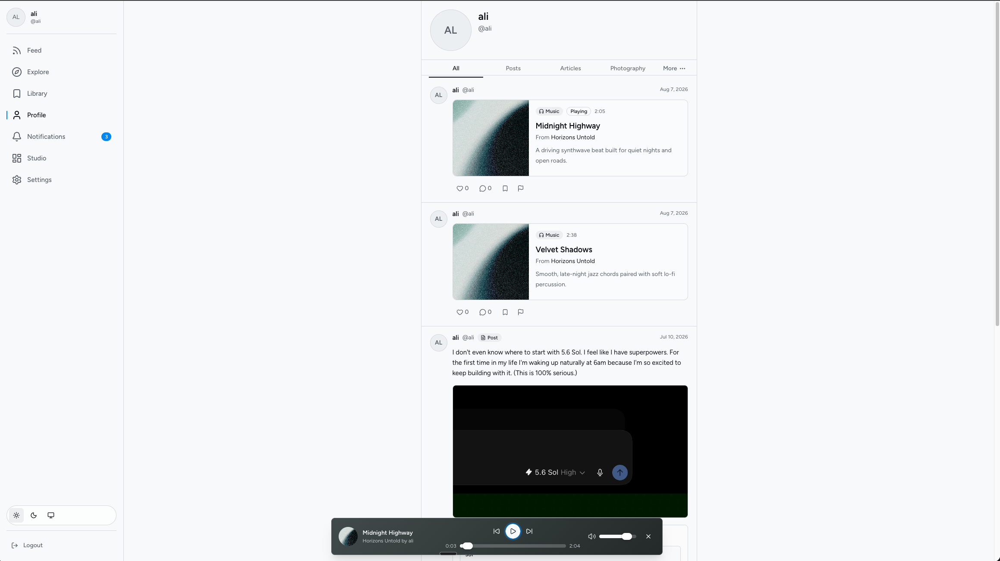
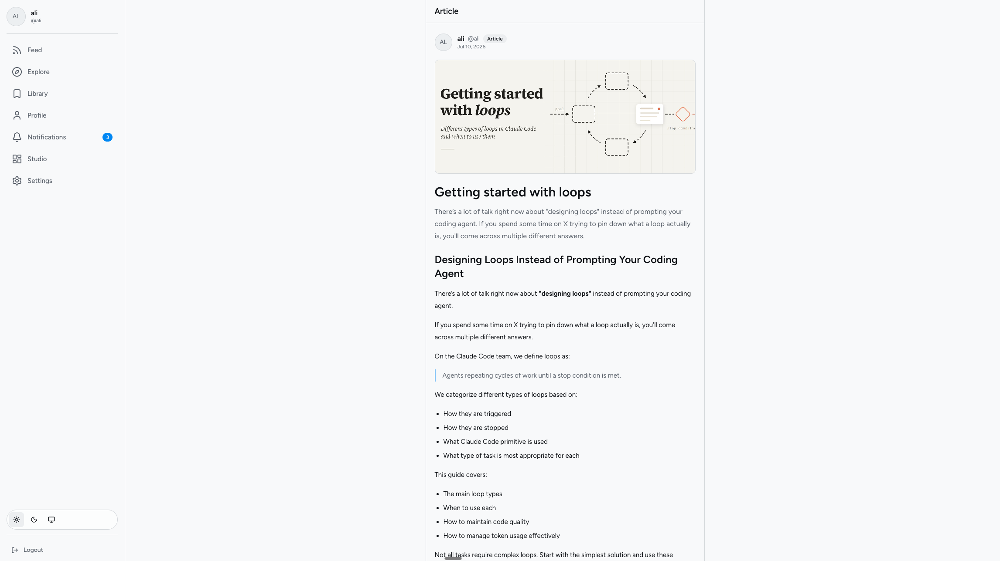
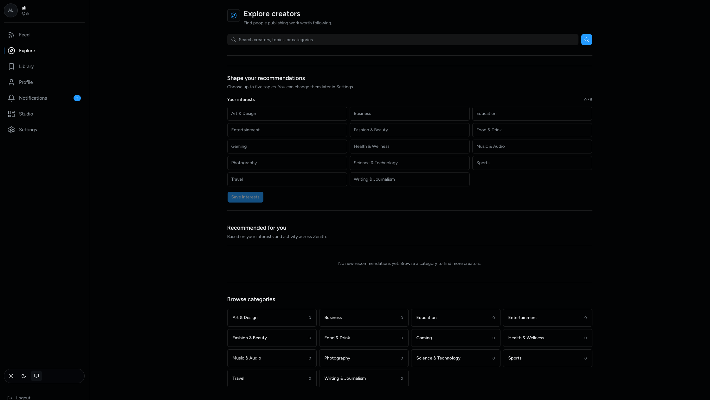
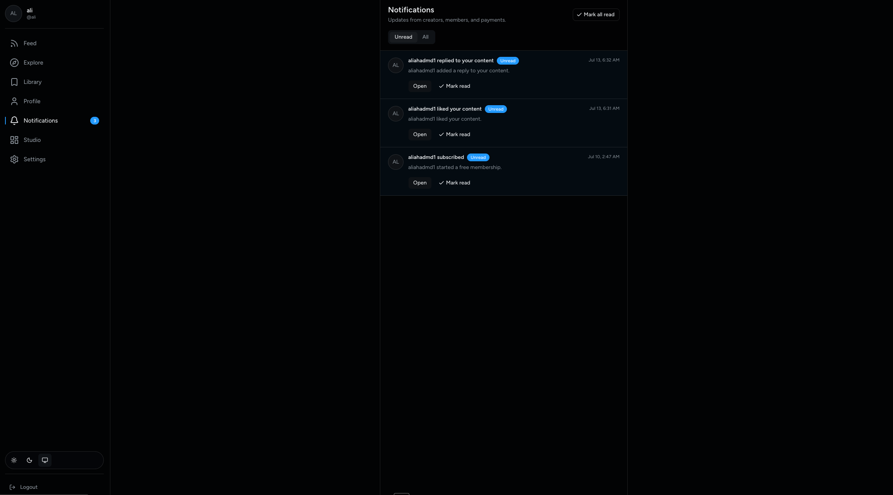
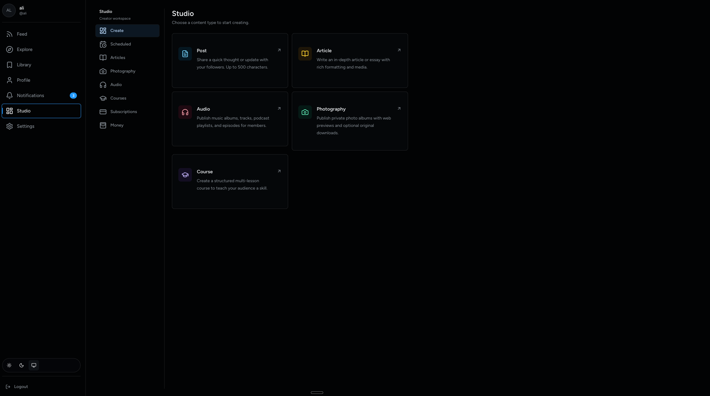
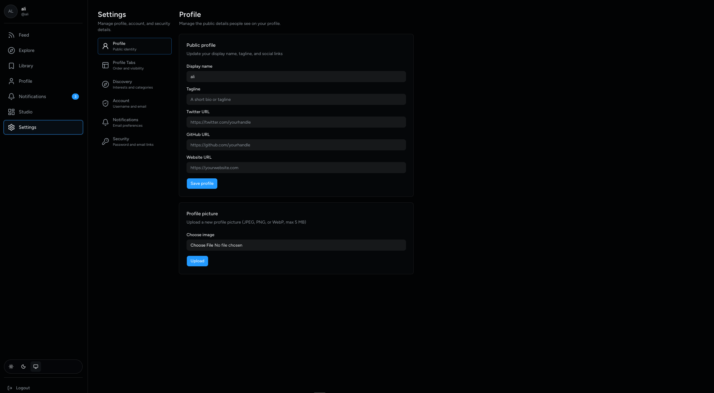

# Zenith

**A subscription-first creator network — publish every kind of content, grow a member base, and get paid.**

🌐 **Live demo: [zenith.aliahad.com](https://zenith.aliahad.com)**

Zenith is a full-stack platform where creators publish posts, articles, music & podcasts, photography, and courses behind one membership — and where subscribers follow the people they care about in a single feed. Think "Patreon meets a personal publication," built entirely on the edge.

---

## 🔑 Try the demo

Sign in at **[zenith.aliahad.com](https://zenith.aliahad.com)** with either of these demo accounts:

| Role | Email | Password |
|---|---|---|
| **Creator** (owns the Studio) | `ali@aliahad.com` | `12345@zenith` |
| **Subscriber** (member of the audience) | `aliahadmd1@gmail.com` | `12345@zenith` |

> 💳 Payments in the demo run on **Stripe test mode** — you can walk through the full checkout and payout flows with the card number `4242 4242 4242 4242` and nothing is ever charged.

---

## What you can do with it

### 📰 One feed for everything you follow

Subscribers get a single, quiet timeline of everything their creators publish — short posts, long-form articles, playable music and podcast episodes, photo albums, and courses. There's a global audio player that follows you around the app, likes, threaded discussions, polls, and a personal **Library** where anything you save stays organized.



### 📖 Long-form reading that feels like a publication

Articles are written in Markdown in the built-in editor, published with a cover, and rendered in a clean, distraction-free reader — with comments, likes, and save-for-later built in.



### 🧭 Discovery that actually helps creators get found

New members pick a few interests and Zenith recommends creators across 14 curated categories, with featured creators curated by admins and search with smart sorting.



### 🔔 Notifications that keep both sides engaged

Creators see new subscribers, likes, and replies the moment they happen; subscribers hear about new content from creators they follow. Email delivery is wired in alongside the in-app inbox.



### 🎨 A Studio built for making, not managing

The creator Studio is one workspace for five content types — quick posts, deep articles, audio albums & podcasts, private photography albums (with original-file downloads for members), and structured multi-lesson courses. Everything supports **draft → schedule → publish** with automatic retries, plus moderation status at a glance.



### ⚙️ Membership and money, handled

Creators connect Stripe, pick their model — free, free trial, or paid monthly/yearly — and watch revenue, MRR, member mix, and payouts on a live dashboard. Zenith takes a configurable platform fee (10% by default) automatically through Stripe Connect. Subscribers get a self-serve billing portal.

### 👤 Your profile, your rules

Profiles are customizable down to which tabs appear and in what order, with avatars, taglines, and social links.



---

## 🗺️ A 5-minute demo tour

1. **Sign in as the subscriber** (`aliahadmd1@gmail.com`) → land in the **Feed**. Press play on a track and browse while the player keeps going. Like something, reply to a post, and **save** an article to your **Library**.
2. Visit the creator's profile → check out the **Photography** tab, open an album, and try the lightbox. Peek at **Subscriptions** to see membership status.
3. **Log out, sign in as the creator** (`ali@aliahad.com`) → open the **Studio**. Create a quick post, start an **Article** draft, or explore **Audio** and **Courses**.
4. Open **Studio → Money** to see the revenue dashboard, then **Studio → Subscriptions** to see Stripe Connect onboarding and plan settings.
5. Check **Notifications** on both accounts to see how the two sides stay in sync.

---

## 🛠️ Under the hood

Zenith is a single **Cloudflare Worker** serving both the API and the app — no servers, no containers:

- **Backend** — Hono on Cloudflare Workers, Drizzle ORM on D1 (SQLite at the edge), R2 for all media storage, Better Auth (password + verified email), Stripe Connect & Billing (sandbox-only in this build), transactional email via Cloudflare Email Routing
- **Frontend** — React 19, TanStack Router + Query, Tailwind CSS v4, shadcn/ui, Markdown with sanitization, drag-and-drop reordering everywhere
- **Background jobs** — scheduled publishing and membership maintenance run on a Cloudflare cron trigger with a D1-backed job queue (lease/retry semantics, idempotent Stripe webhooks)
- **Quality** — 168 automated tests: backend integration tests run inside a real workerd with live D1/R2 bindings; frontend tests via Testing Library

## 💻 Run it locally

```bash
npm install
npx wrangler d1 migrations apply DB --local   # set up the local database
npm run dev                                   # http://localhost:5173
```

Other useful commands:

```bash
npm test          # backend + frontend test suites
npm run check     # production build + deploy dry-run
npm run deploy    # ship to Cloudflare
```

You'll need a Cloudflare account and a `wrangler login` session; Stripe is intentionally locked to sandbox keys (`STRIPE_MODE=test`).

---

*Built by [Ali](https://aliahad.com) — questions about the project? Reach out.*
